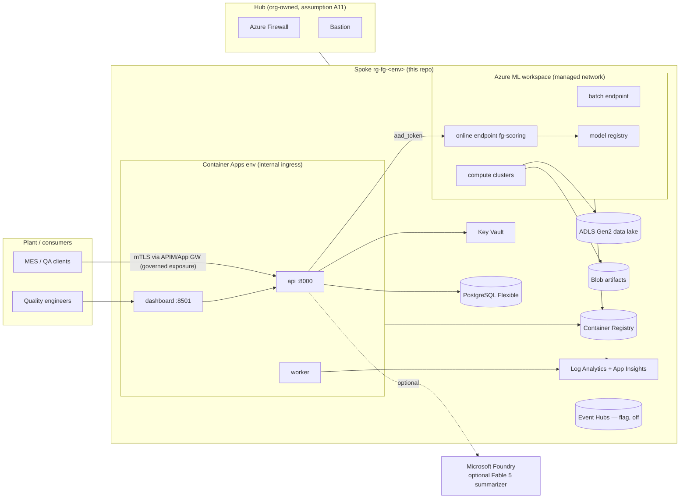

# Azure target architecture (Phase 7 — design + code, not deployed)

Implements spec §13 on the decisions in ADR-0009 (AML + Container Apps, no
AKS), ADR-0010 (Entra ID auth), ADR-0011 (private networking), ADR-0013
(Bicep), ADR-0014 (OIDC CI identity). Everything below exists as
lint-validated code in `infrastructure/bicep/` and `deployment/azureml/`;
**nothing has been deployed** — execution requires subscription, credentials,
region, and cost approval.

## System overview

Key placements:

- **Application API** (contract, auth, policy engine, hash-chained audit) runs
  in Container Apps; **model scoring** runs behind the AML managed online
  endpoint and is called via the `RemoteScorer` (ADR-0008). Locally the same
  API uses `InProcessScorer` — one codebase, config-switched.
- **Batch scoring** mirrors this: local pipeline runner ↔ AML batch endpoint.
- **MLflow tracking** is the AML workspace's built-in MLflow server; the
  registry promotion gates (`mlops/registry.py`, promotion.yaml) run in the
  release pipeline with human approval (ADR-0017), then the champion is
  deployed as the endpoint's model.
- **Event Hubs** exists as a flag-gated module only — ingestion is batch+REST
  per ADR-0021 until streaming is justified.

## Environment strategy

| | dev | prod |
|---|---|---|
| Resource group | rg-fg-dev | rg-fg-prod |
| Policies | audit (`DoNotEnforce`) | enforce |
| Delete lock | no | CanNotDelete |
| PostgreSQL | Burstable B2ms, no HA | D4ds_v5, zone-redundant HA, geo-backup |
| Storage | LRS | ZRS |
| Images | moving tags allowed | digest-pinned (spec §14) |
| Container Apps | 1–2 replicas | 2–10, zone-redundant |
| AML workspace | hbi off | hbi on |
| GPU cluster | none | sized from `docs/performance/gb10-benchmark.md` |

Staging = the prod parameter file with `env=staging`, smaller SKUs, and the
`staging` GitHub environment; kept out of the repo until an org needs it to
avoid a third drift-prone copy.

## Sizing rationale (measurement-derived, spec §25)

The GB10 benchmark measured service P50/P95/P99 = 43/56/57 ms for the full
in-process prediction path on CPU, DINOv2 at 1566 img/s on GPU, and TS
embedding at 317k units/s. Consequences:

- **Online scoring is CPU-viable**: single-unit latency is dominated by
  Python orchestration, not model math. The online deployment starts on a
  general-purpose CPU instance; GPU serving is not justified (OI-2/ONNX
  stayed optional for the same reason).
- **Training**: tiny/small profiles are CPU-fine (cpu-cluster, min 0 nodes);
  medium/large and DINOv2 embedding extraction want the flag-gated GPU
  cluster. Choose the exact SKU at deploy time from the benchmark ratios, not
  from this document.

## What is deliberately absent

- **AKS** — rejected with revisit triggers (ADR-0009).
- **Vector DB / feature store / event-stream emulator** — removed in ADR-0021.
- **Public ingress** — any external exposure is an explicit App Gateway + WAF
  or API Management exception in front of the internal Container Apps env
  (ADR-0011), not part of the default stack.
- **CMK encryption** — platform-managed keys by default; CMK is documented as
  the high-assurance option in `security-architecture.md`.

Companion documents: `network-topology.md` (subnets, DNS, port/protocol
matrix), `data-flow.md` (training/inference/feedback flows + trust
boundaries), `security-architecture.md` (identities, RBAC matrix, secrets),
`../operations/azure-deployment-runbook.md` (ordered procedure + rollback),
`../operations/foundry-integration.md`.
