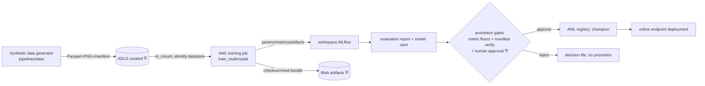
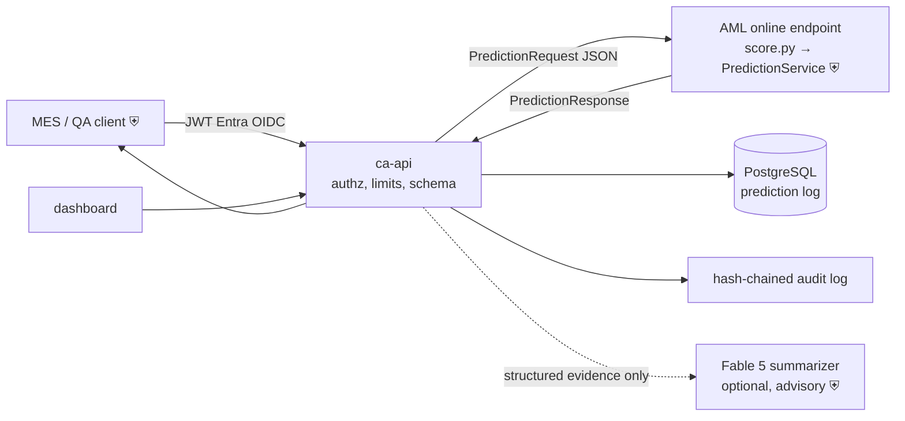
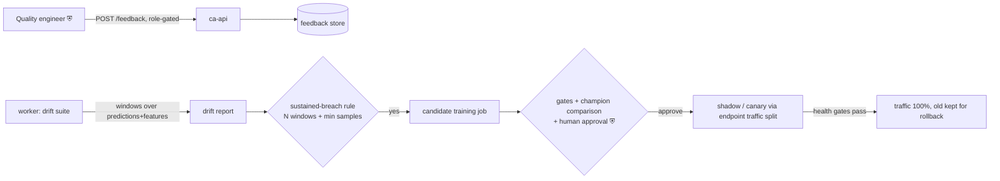

# Data flow (Azure target)

Trust boundaries are marked ⛨; every crossing authenticates with Entra
(managed identity or user OIDC) and is TLS-encrypted. No connection uses a
shared key or password anywhere in the system.

## Training / promotion flow

Lineage invariants (enforced in code, spec §22): every run records git
commit, dataset manifest SHA-256, feature version, seed, config; the serving
bundle is manifest-verified (`verify_manifest`) before **every** load — a
tampered artifact fails closed.

## Online inference flow

- The API treats scorer responses as **untrusted input** (schema-validated,
  ADR-0008) — a compromised scoring container cannot inject actions.
- Assistant calls carry only the enumerated evidence fields (D-033); no
  caller text reaches the generative model, and its output is advisory
  display text only.
- `hold_unit` / `escalate` recommendations are created `PENDING_APPROVAL` and
  require an authorized human role (ADR-0017) — the model never actuates.

## Feedback / retraining loop

No automatic promotion, ever (spec §21): the breach rule only *creates a
candidate*; a human approves before staging, and canary progression is
gate-checked (runbook §7).

## Data classification and retention

| Data | Store | Class | Notes |
|---|---|---|---|
| Synthetic units/sensors/images | ADLS curated | synthetic (no real data) | reproducible from seed + manifest |
| Model bundles + manifests | Blob `models` | internal | SHA-256 manifest, verified on load |
| Prediction logs | Blob `prediction-logs` + PostgreSQL | internal | no images/tokens; configurable retention (spec §15) |
| Feedback | PostgreSQL | internal | validated against prediction ids |
| Audit log (recommendations, promotions) | Blob (append-only) + PostgreSQL | restricted | hash-chained, tamper-evident; retention-protected storage recommended |
| Telemetry | Log Analytics | internal | redacting formatter; no payloads/secrets in logs |
| Secrets | Key Vault only | secret | RBAC, purge protection, no secrets in code/config/CI |

Operators are pseudonymous by construction and the prohibited-use rule
(no scoring individuals for employment decisions) applies across every flow
(spec §15, `docs/responsible-ai/`).
