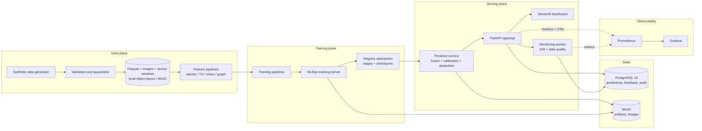

# Local Architecture (GB10)

Everything runs on the GB10 workstation: Python processes in a venv for development, Docker Compose for the service stack. GPU access via NVIDIA Container Toolkit (verified) or the host venv.

## Components

| Component | Runs as | Port (localhost only) | Notes |
|---|---|---|---|
| API (`apps/api`) | container / venv | 8000 | non-root, read-only fs where feasible |
| Dashboard (`apps/dashboard`) | container / venv | 8501 | Streamlit |
| Worker (`apps/worker`) | container / venv | — | drift + monitoring loops |
| MLflow | container | 5000 | backend: PostgreSQL, artifacts: MinIO |
| PostgreSQL 16 | container | 5432 | app metadata, predictions, audit |
| MinIO | container | 9000/9001 | S3-compatible object store abstraction |
| Prometheus | container | 9090 | scrapes API/worker |
| Grafana | container | 3000 | provisioned dashboards |

Bindings are `127.0.0.1` only — no public exposure by default (working principle 19).

## Trust boundaries (local)

1. Host ↔ containers (Docker, non-privileged, no docker.sock mounts into app containers).
2. API ↔ callers (dev JWT auth still enforced locally; auth cannot be disabled in prod config).
3. Services ↔ object store / DB (dedicated non-root credentials from `.env`, never committed).
4. Model artifacts (untrusted until checksum-verified against registry manifest).

Expanded security detail: `docs/architecture/security-architecture.md`, threat model in `docs/security/threat-model.md`.
