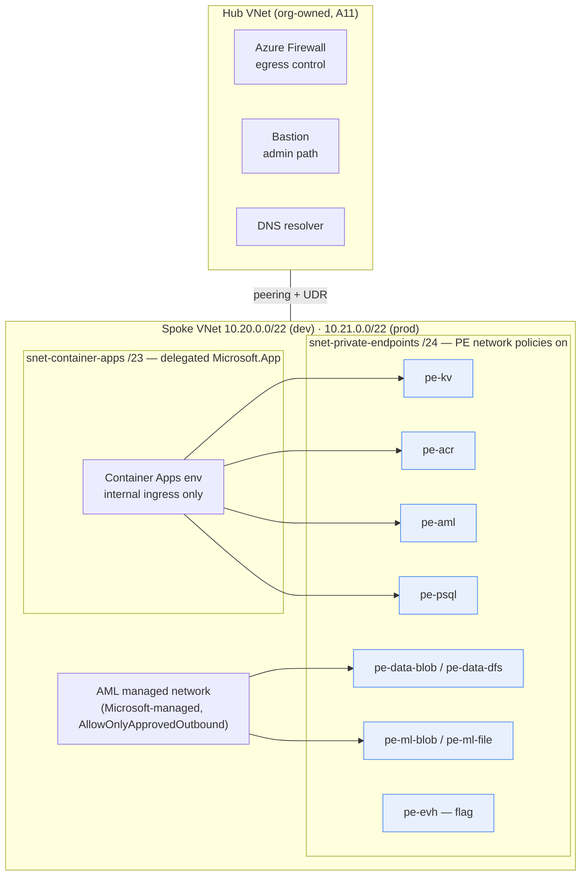

# Network topology (ADR-0011 — zero public endpoints)

## Address plan and subnets

- Every PaaS dependency (storage ×2, Key Vault, ACR, AML workspace,
  PostgreSQL, Event Hubs when enabled) has `publicNetworkAccess: Disabled`
  and is reachable only through a private endpoint in
  `snet-private-endpoints`.
- The **AML managed network** is Microsoft-managed isolation around compute
  and managed endpoints with `AllowOnlyApprovedOutbound` and **no FQDN
  rules**: training images bake all dependencies and pretrained weights at
  build time (spec §14), so jobs need no internet egress.
- **Egress** from the spoke routes to the hub firewall via the
  `egressRouteTableId` parameter (route table owned by the hub team). NSGs
  allow outbound 443 because egress *governance* is the firewall's job.
- **Admin path** is Bastion in the hub. No public SSH/RDP anywhere;
  `remoteLoginPortPublicAccess: Disabled` on AML compute.
- Hub-side DNS forwards the `privatelink.*` zones to the spoke's private DNS
  zones (linked to the spoke VNet, registration off, records managed solely
  by private-endpoint zone groups).

## Private DNS zones

`privatelink.blob|dfs|file.core.windows.net`, `privatelink.vaultcore.azure.net`,
`privatelink.azurecr.io`, `privatelink.api.azureml.ms`,
`privatelink.notebooks.azure.net`, `privatelink.postgres.database.azure.com`,
`privatelink.servicebus.windows.net` (zone created even while Event Hubs is
off — creating zones is free and keeps the flag flip additive).

## Port / protocol matrix

| # | Source | Destination | Port/Proto | Purpose | Control |
|---|---|---|---|---|---|
| 1 | APIM / App GW (exception path) | ca-api | 443→8000 TCP/HTTP | governed external API exposure | deliberate ADR-0011 exception, WAF, mTLS at gateway |
| 2 | VNet clients | ca-api | 8000 TCP | predictions/feedback/monitoring | NSG rule `AllowVnetInboundHttp`; Entra JWT on every route |
| 3 | VNet clients | ca-dashboard | 8501 TCP | Streamlit dashboard | same NSG rule; SSO at gateway |
| 4 | ca-api | AML online endpoint | 443 TCP | model scoring (RemoteScorer) | private endpoint; `aad_token` auth |
| 5 | ca-api / worker | PostgreSQL PE | 5432 TCP | metadata, prediction log | Entra-only auth, TLS required |
| 6 | ca-api / worker | Key Vault PE | 443 TCP | secret retrieval | managed identity, RBAC |
| 7 | ca-* | ACR PE | 443 TCP | image pull | AcrPull via UAMI |
| 8 | ca-api / worker | Blob artifacts PE | 443 TCP | model bundles, prediction logs | Storage Blob Data roles |
| 9 | AML compute | ADLS/Blob PEs | 443 TCP | datasets, artifacts | identity-based datastores |
| 10 | AML compute | file share PE | 445 TCP | workspace file store | workspace MSI |
| 11 | producers (future) | Event Hubs PE | 5671/5672 AMQP-TLS | streaming ingestion (flag) | Entra only (`disableLocalAuth`) |
| 12 | spoke | hub firewall | all egress | controlled egress | UDR + firewall policy (hub-owned) |
| 13 | api/dashboard/worker | App Insights ingestion | 443 TCP | OTel telemetry | Entra ingestion (`DisableLocalAuth`); AMPLS is the hardening step if the org requires fully-private telemetry |
| 14 | Prometheus-compatible scraper (if used) | ca-api `/metrics` | 8000 TCP | metrics scrape | VNet-internal only; documented anonymous exception D-037 |

Everything not listed is denied: NSGs end in `DenyAllInbound` (both subnets)
and `DenyAllOutbound` after VNet+443 (container-apps subnet); PaaS firewalls
default-deny with `bypass: AzureServices` only.

## Known exceptions (documented, deliberate)

1. **Log Analytics / App Insights ingestion is public-endpoint** (Entra-auth,
   TLS) until the org adds an Azure Monitor Private Link Scope — AMPLS
   changes DNS behavior VNet-wide and is a hub-level decision.
2. **`/metrics` is anonymous** within the VNet (aggregate counters only,
   D-037); in Azure the scrape path stays VNet-internal.
3. **External API exposure** happens only via APIM/App GW + WAF as a
   deliberate, reviewed change (row 1), never by flipping ingress to
   external.
