# FactoryGuard AI

## Complete Beginner-to-Architect Tutorial

| | |
|---|---|
| **Repository commit** | `700f5ad` — "Phase 7: Azure design + code (unexecuted)" |
| **Tutorial generated** | 2026-07-19 |
| **Project status** | Phases 0–7 complete; Phase 8 (hardening + final report) not started |
| **Intended audience** | Technically curious readers with no prior knowledge of this project — through to engineers who want to run, modify, and extend it |
| **Cloud status** | **No Azure resources have ever been deployed by this project.** All Azure material is code and documentation, validated locally only (see `docs/open-issues.md`, OI-10) |

Evidence discipline: every chapter of this tutorial was written against the
actual repository (see [`tutorial-source-map.md`](tutorial-source-map.md) for
the per-chapter evidence index and
[`tutorial-validation-report.md`](tutorial-validation-report.md) for the
checks run on this document). Throughout, component status is labeled with one
of:

- **Implemented and tested** — code exists and tests covering it pass (traceable to `docs/test-evidence.md`).
- **Implemented but not fully tested** — code exists; coverage is partial.
- **Defined as infrastructure or configuration** — exists as IaC/YAML/config, locally validated, never executed against a cloud.
- **Documented design only** — described in docs/ADRs, no code.
- **Not executed because Azure credentials were unavailable** — by design; the GB10 development machine has no subscription, credentials, or `az` CLI.
- **Optional and disabled by default** — present but dormant until explicitly enabled.
- **Planned or incomplete** — Phase 8 or later.

---

## Table of contents

- [How to use this tutorial](#how-to-use-this-tutorial)
- [Chapter 1: What FactoryGuard AI Is](#chapter-1-what-factoryguard-ai-is)
- [Chapter 2: The Manufacturing Domain](#chapter-2-the-manufacturing-domain)
- [Chapter 3: The Big-Picture Architecture](#chapter-3-the-big-picture-architecture)
- [Chapter 4: Development Environment and GB10](#chapter-4-development-environment-and-gb10)
- [Chapter 5: Repository Tour](#chapter-5-repository-tour)
- [Chapter 6: Configuration System](#chapter-6-configuration-system)
- [Chapter 7: Synthetic Data Generation](#chapter-7-synthetic-data-generation)
- [Chapter 8: Data Validation and Contracts](#chapter-8-data-validation-and-contracts)
- [Chapter 9: Feature Engineering](#chapter-9-feature-engineering)
- [Chapter 10: Machine-Learning Fundamentals](#chapter-10-machine-learning-fundamentals)
- [Chapter 11: Tabular Models](#chapter-11-tabular-models)
- [Chapter 12: Time-Series Modeling](#chapter-12-time-series-modeling)
- [Chapter 13: Computer Vision and DINOv2](#chapter-13-computer-vision-and-dinov2)
- [Chapter 14: Graph Features and Root-Cause Context](#chapter-14-graph-features-and-root-cause-context)
- [Chapter 15: Multimodal Fusion](#chapter-15-multimodal-fusion)
- [Chapter 16: Serving Modes and Cold Start](#chapter-16-serving-modes-and-cold-start)
- [Chapter 17: Calibration, Uncertainty, OOD, and Abstention](#chapter-17-calibration-uncertainty-ood-and-abstention)
- [Chapter 18: Evaluation Framework](#chapter-18-evaluation-framework)
- [Chapter 19: Explainability](#chapter-19-explainability)
- [Chapter 20: Recommendation Engine](#chapter-20-recommendation-engine)
- [Chapter 21: Optional Assistant Layer](#chapter-21-optional-assistant-layer)
- [Chapter 22: API Design](#chapter-22-api-design)
- [Chapter 23: Authentication and Authorization](#chapter-23-authentication-and-authorization)
- [Chapter 24: Dashboard](#chapter-24-dashboard)
- [Chapter 25: Experiment Tracking and Model Registry](#chapter-25-experiment-tracking-and-model-registry)
- [Chapter 26: Monitoring and Observability](#chapter-26-monitoring-and-observability)
- [Chapter 27: Drift Detection and Retraining](#chapter-27-drift-detection-and-retraining)
- [Chapter 28: Security Architecture](#chapter-28-security-architecture)
- [Chapter 29: Secure Software Supply Chain](#chapter-29-secure-software-supply-chain)
- [Chapter 30: Containers and Local Runtime](#chapter-30-containers-and-local-runtime)
- [Chapter 31: Testing Strategy](#chapter-31-testing-strategy)
- [Chapter 32: CI/CD](#chapter-32-cicd)
- [Chapter 33: Infrastructure as Code](#chapter-33-infrastructure-as-code)
- [Chapter 34: Azure Architecture](#chapter-34-azure-architecture)
- [Chapter 35: Azure Machine Learning Workflow](#chapter-35-azure-machine-learning-workflow)
- [Chapter 36: Microsoft Foundry in FactoryGuard](#chapter-36-microsoft-foundry-in-factoryguard)
- [Chapter 37: Azure Container Apps Runtime](#chapter-37-azure-container-apps-runtime)
- [Chapter 38: Azure Security Walkthrough](#chapter-38-azure-security-walkthrough)
- [Chapter 39: Deployment and Rollback](#chapter-39-deployment-and-rollback)
- [Chapter 40: Demonstration Scenarios](#chapter-40-demonstration-scenarios)
- [Chapter 41: Troubleshooting](#chapter-41-troubleshooting)
- [Chapter 42: Safe Extension Guide](#chapter-42-safe-extension-guide)
- [Chapter 43: Learning Exercises](#chapter-43-learning-exercises)
- [Chapter 44: Frequently Asked Questions](#chapter-44-frequently-asked-questions)
- [Chapter 45: Current Project Status](#chapter-45-current-project-status)
- [Chapter 46: Suggested Learning Path](#chapter-46-suggested-learning-path)
- [Chapter 47: Glossary](#chapter-47-glossary)
- [Chapter 48: Repository Reference](#chapter-48-repository-reference)
- [Appendix A: Quick Start](#appendix-a-quick-start)
- [Appendix B: Command Reference](#appendix-b-command-reference)
- [Appendix C: Configuration Reference](#appendix-c-configuration-reference)
- [Appendix D: API Examples](#appendix-d-api-examples)
- [Appendix E: Metrics Cheat Sheet](#appendix-e-metrics-cheat-sheet)
- [Appendix F: Security Control Matrix](#appendix-f-security-control-matrix)
- [Appendix G: Azure Resource Matrix](#appendix-g-azure-resource-matrix)
- [Appendix H: ADR Summary](#appendix-h-adr-summary)
- [Appendix I: Exercise Answers](#appendix-i-exercise-answers)
- [Appendix J: Specification-to-Implementation Traceability](#appendix-j-specification-to-implementation-traceability)
- [Appendix K: Phase History](#appendix-k-phase-history)
- [Appendix L: Production Readiness Checklist](#appendix-l-production-readiness-checklist)

---

## How to use this tutorial

**Suggested reading order.** Chapters are ordered so each builds on the ones
before it: domain (1–2) → architecture (3) → environment and repo (4–6) → data
(7–9) → machine learning (10–17) → evaluation and explanation (18–21) →
application (22–26) → operations (27) → security (28–29) → runtime and
delivery (30–32) → cloud (33–39) → practice (40–48). You can also follow one
of the role-based tracks in [Chapter 46](#chapter-46-suggested-learning-path).

**Conceptual vs. hands-on.** Chapters 1–3, 10, 16–21, 28, 34, 36–38 are mostly
conceptual. Chapters 4–9, 11–15, 22–27, 30–33, 39–43 contain hands-on
material. Every command in the tutorial carries one of these labels:

- **Verified locally** — executed on the development machine with the result recorded in `docs/test-evidence.md` or in this tutorial's validation report.
- **Expected but not rerun** — the command exists and worked previously; it was not re-executed while writing this tutorial.
- **Requires Docker stack** — needs `make up` services running.
- **Requires GPU** — needs the CUDA-capable GPU (vision/TS training paths).
- **Requires Azure CLI** / **Requires Azure credentials** — cannot run on the current machine at all.
- **Planning/validation only** — inspects or validates without changing anything.
- **May create billable Azure resources** — ⚠️ never run these casually.

**Prerequisites by exercise level.** Beginner exercises need only Python and
the repo (CPU is enough for the `tiny` profile). Intermediate exercises use
`make` targets and sometimes the Docker stack. GPU-flagged exercises need
CUDA. Everything in Chapters 33–39 marked Azure is **planning-only** in this
environment: the machine this project was built on has no Azure subscription,
no credentials, and no `az` CLI — that is deliberate, and the tutorial never
asks you to create cloud resources without a prominent warning.

**Glossary and paths.** Unfamiliar term → [Chapter 47](#chapter-47-glossary).
Every chapter ends with **Repository paths used** so you can jump from prose
to code. Paths are relative to the repository root.

---

## Chapter 1: What FactoryGuard AI Is

> **What you will learn:** the manufacturing problem, what the system predicts
> and produces, the advisory-only boundary, and the journey of one production
> unit through the whole platform.

### The problem

Factories that build **wire harnesses** (bundles of cut, crimped, and
assembled wires that carry power and signals inside cars, appliances, and
machinery) discover most quality defects at **end-of-line inspection** — after
all the value has been added. A crimp that was formed by a worn tool at 09:14
is found bad at 15:40, by which time hundreds of further units have passed
through the same tool. Scrap, rework, and warranty risk all scale with that
delay.

FactoryGuard AI predicts defect risk **per production unit, before end-of-line
inspection**, using four kinds of evidence that already exist in a modern
plant: process measurements (tabular data), machine sensor waveforms
(time series), inspection camera images (vision), and the web of relationships
between units, tools, machines, operators, and supplier material lots
(a graph).

### The advisory boundary

This is the single most important design constraint, and it is enforced in
code, not just promised in documents:

> **Security note:** FactoryGuard **never controls machinery**. Its outputs
> are predictions, explanations, ranked root-cause *hypotheses*, and
> recommended *human* actions drawn from a fixed allow-list
> (`src/factoryguard/recommendations/engine.py`, `ACTION_TAXONOMY`). The two
> high-impact actions (`hold_unit`, `escalate`) are always created in state
> `PENDING_APPROVAL` and require an authorized human approver. Generative-AI
> text, where enabled at all, is marked `advisory: true` in the API contract
> itself (`src/factoryguard/contracts/v1.py`) and is never parsed back into
> decisions.

### What the system outputs

For each unit, the Application Programming Interface (API) returns one
`PredictionResponse` (**Implemented and tested** — contract in
`src/factoryguard/contracts/v1.py`, exercised end-to-end in
`tests/end_to_end/test_api_flow.py`) containing:

1. a **risk score**, and — only in supervised mode — a **calibrated defect probability**;
2. per-defect-category probabilities and severity where available;
3. **uncertainty**: a conformal prediction set, an Out-of-Distribution (OOD) flag, and possibly an **abstention** ("I refuse to answer confidently") with reasons;
4. the **serving mode** that produced the answer (anomaly-only / blended / supervised — Chapter 16);
5. per-modality availability (which inputs were present, which were missing and why);
6. **top evidence** and a ranked list of **root-cause candidates** (entities like a specific tool or supplier lot, scored by association — *not* causal proof);
7. **recommended actions** from the allow-listed taxonomy;
8. **similar historical incidents**;
9. an optional advisory **assistant summary** (plain-language restatement, Chapter 21).

### Who uses it

- **Quality engineers** review flagged units, approve holds, give feedback.
- **Plant viewers** watch line health on the dashboard.
- **ML engineers** train, evaluate, promote, and roll back models.
- **Data stewards** own data quality; **auditors** read the tamper-evident audit log; **platform admins** operate the service; **service** identities call the API machine-to-machine. (These seven roles are the authorization model — Chapter 23.)

### One unit, end to end

Follow unit `U-…` through the system (this exact flow is executed by the
end-to-end test suite against generated data):

1. A crimping machine produces the unit. The plant's systems know its work order, line, machine, tool, operator, product revision, and the terminal/wire lots consumed. Process measurements (crimp height, pull force, cycle time…) are recorded, the machine logs a crimp-force waveform, and a camera may capture an inspection image.
2. A client `POST`s all of this to `/api/v1/predictions` with a JSON Web Token (JWT) carrying its role.
3. The API authenticates, authorizes, rate-limits, size-checks, and schema-validates the request; every response carries a correlation ID.
4. The inference service builds features per modality, runs the tabular/time-series/vision/graph models, fuses their calibrated scores, applies conformal uncertainty + OOD checks, and decides whether to answer or abstain.
5. The root-cause ranker scores candidate entities (this tool? that lot?) against decayed historical evidence; the retrieval index attaches similar past incidents.
6. The deterministic recommendation engine maps the situation onto policies POL-001…POL-008 and emits allow-listed actions; high-impact ones await human approval; everything lands in a hash-chained audit log.
7. The response returns; the dashboard displays it; the engineer's later feedback (`POST /api/v1/feedback`) becomes tomorrow's label.

### Prediction vs. explanation vs. root cause vs. recommendation

These four outputs are deliberately distinct, and confusing them is the most
common way to misuse a system like this:

| Output | Question it answers | Nature |
|---|---|---|
| Prediction | "How risky is this unit?" | statistical estimate |
| Explanation | "What evidence drove that estimate?" | attribution over inputs |
| Root-cause ranking | "Which entity is most *associated* with the elevated risk?" | ranked hypothesis, association only |
| Recommendation | "What should a human do about it?" | deterministic policy output, allow-listed, approval-gated |

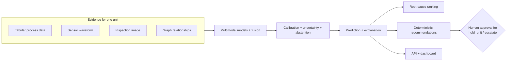

> **Key takeaways:** FactoryGuard predicts unit-level defect risk before
> inspection from four evidence types; it is advisory by construction; its
> four output kinds (prediction, explanation, root-cause hypothesis,
> recommendation) are distinct artifacts with distinct guarantees.

**Repository paths used:** `README.md`, `src/factoryguard/contracts/v1.py`,
`src/factoryguard/recommendations/engine.py`,
`tests/end_to_end/test_api_flow.py`.

---

## Chapter 2: The Manufacturing Domain

> **What you will learn:** enough wire-harness manufacturing to understand
> every entity and defect mechanism in the synthetic world model.

### Wire harnesses and how they are made

A wire harness starts as spools of wire and boxes of terminals (the small
metal connectors crimped onto wire ends). The core steps: **cut** wire to
length → **strip** insulation → **crimp** a terminal onto the conductor with a
press and a die ("tool") → optionally **seal** → **assemble** into connectors
and bundles → **test** electrically and visually at end of line.

**Crimping** is where most of this project's physics lives. A good crimp
compresses the terminal around the wire strands to a precise **crimp height**
(measured in millimeters against a setpoint) and survives a **pull-force**
test. The crimping **tool** wears with every cycle: a worn tool produces
crimps that drift low and wide, insulation damage, and eventually loose
strands.

### The entity model

The synthetic world (`src/factoryguard/data/world.py` — **Implemented and
tested**) models a realistic plant hierarchy. Sizes below are the `tiny`
profile (`configs/data/tiny.yaml`); `small`/`medium`/`large` scale up.

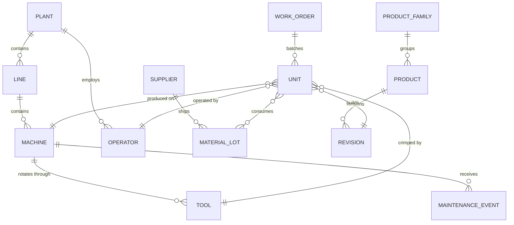

Domain facts the generator encodes, all of which matter to the models later:

- **Tool wear** accumulates per cycle (`tool_age_cycles`) and resets when maintenance replaces the tool; tools rotate round-robin across a machine's tool set (this rotation was added to fix a real leakage bug — see D-024 in `docs/decision-log.md` and Chapter 9).
- **Supplier lots** (terminal and wire lots) are consumed and replaced; a bad lot raises defect risk on *every* line that consumes it — a cross-line signal only the graph sees.
- **Operators and shifts**: pseudonymous operator IDs; a night-shift load mechanism mildly elevates risk. (Responsible-AI rule: never score individual workers — spec §15.)
- **Revisions**: a new product revision shifts the data distribution — the OOD scenario.
- **Cameras drift**: a misaligned camera blurs images *without changing the true label* — a data-quality problem that must not be confused with a defect (Scenario C).
- **Process drift**: sensors drift slowly per day; humidity crosses thresholds; changeovers make the first pieces after a switch riskier.

### Why manufacturing data is relational and temporal

A unit's risk is not a function of its own measurements alone: it depends on
*which* tool (and how worn), *which* lot (and who else had trouble with it),
and *when* (before or after maintenance, early or late in a shift). That is
why the platform is multimodal + graph-aware, and why every evaluation split
respects time (Chapter 18): using tomorrow's knowledge to predict today is the
cardinal sin called **leakage**.

> **Beginner note:** everything in this repository runs on **synthetic** data
> generated from this world model. No real factory data, no real people. The
> generator also writes the *latent truth* (which mechanism actually caused
> each defect) into a separate `ground_truth/` area that models are forbidden
> to read — that is what lets the project *measure* whether root-cause ranking
> works (Chapter 19).

> **Key takeaways:** crimping physics (tool wear, crimp height, pull force)
> drives the core signals; entities form a relational, temporal web; defects
> have distinct causal mechanisms that the synthetic generator implements
> explicitly and records separately as evaluation ground truth.

**Repository paths used:** `src/factoryguard/data/world.py`,
`src/factoryguard/data/mechanisms.py`, `configs/data/tiny.yaml`,
`docs/decision-log.md`.

---

## Chapter 3: The Big-Picture Architecture

> **What you will learn:** every layer of the system, how data flows between
> them, where trust boundaries sit, and how the local stack maps to the Azure
> design.

### The layers

| Layer | What it does | Where | Status |
|---|---|---|---|
| Data | synthetic generation of tables/waveforms/images/graph | `src/factoryguard/data/` | Implemented and tested |
| Validation | schemas, referential integrity, quarantine | `src/factoryguard/data/validation.py` | Implemented and tested |
| Features | tabular + graph feature builders, leakage-safe cutoffs | `src/factoryguard/features/` | Implemented and tested |
| Models | tabular / time-series / vision / forecast baselines | `src/factoryguard/models/` | Implemented and tested |
| Fusion | late fusion (default) + embedding fusion (challenger) | `src/factoryguard/models/fusion/` | Implemented and tested |
| Calibration | Platt/isotonic probability calibration | `src/factoryguard/models/calibration/` | Implemented and tested |
| Uncertainty | conformal sets, Mahalanobis OOD, abstention policy | `src/factoryguard/inference/uncertainty.py` | Implemented and tested |
| Root cause | entity ranking vs decayed history + mechanism evidence | `src/factoryguard/explainability/root_cause.py` | Implemented and tested (evaluated vs ground truth) |
| Retrieval | similar-incident search over concatenated embeddings | `src/factoryguard/inference/retrieval.py` | Implemented and tested |
| Recommendations | deterministic policies + hash-chained audit | `src/factoryguard/recommendations/` | Implemented and tested |
| API | FastAPI, auth, hardening middleware | `src/factoryguard/api/`, `apps/api/` | Implemented and tested |
| Dashboard | Streamlit operator view | `apps/dashboard/main.py` | Implemented and tested (smoke) |
| MLOps | MLflow tracking, gated registry | `src/factoryguard/mlops/` | Implemented and tested |
| Monitoring | Prometheus metrics, OTel traces, drift suite | `src/factoryguard/api/metrics.py`, `src/factoryguard/monitoring/` | Implemented and tested |
| Security | config fail-closed, redaction, checksums, middleware | `src/factoryguard/security/`, `config/`, `api/middleware.py` | Implemented and tested |
| Azure platform | Bicep landing zone, AML assets, runbooks | `infrastructure/bicep/`, `deployment/azureml/` | Defined as infrastructure or configuration; **not executed** |

### Component view

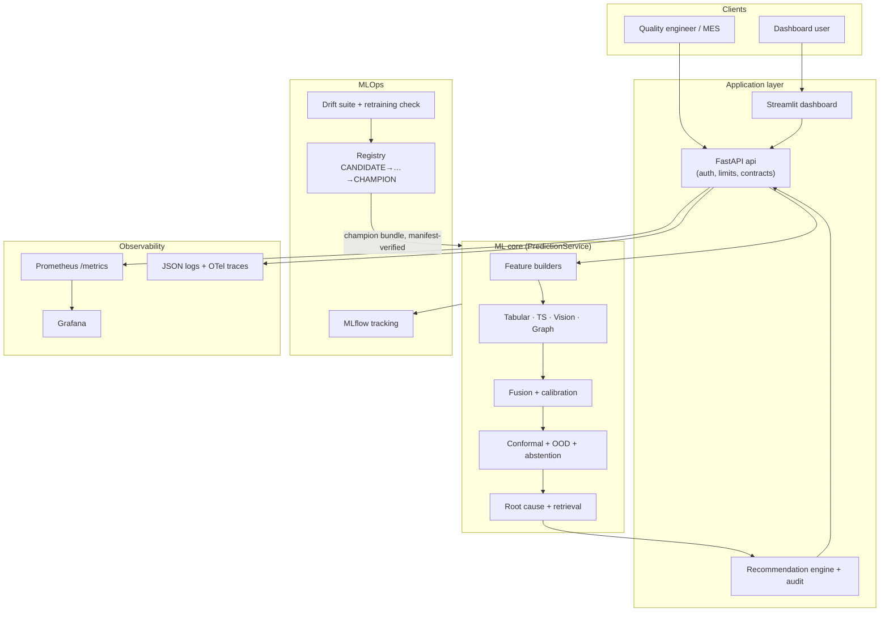

### Data-flow view (training vs serving)

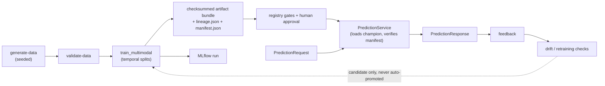

### Trust boundaries

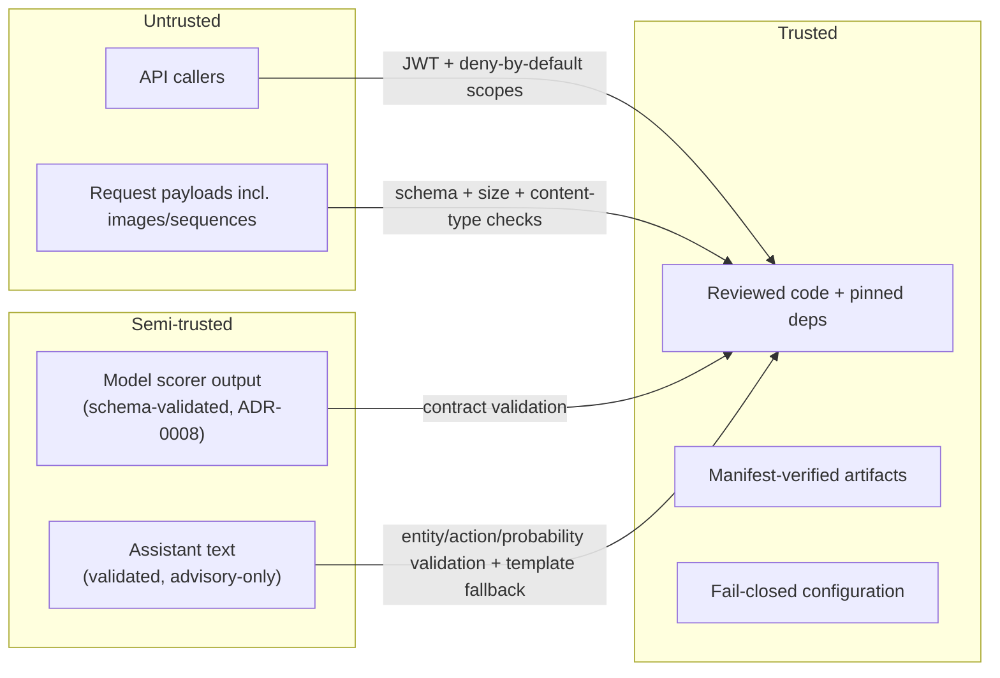

### Local vs Azure

| Concern | Local (implemented, runs today) | Azure (defined, unexecuted) |
|---|---|---|
| API/dashboard/worker | host processes / compose | Container Apps (internal ingress) |
| Model scoring | in-process (`InProcessScorer`) | AML managed online endpoint (`RemoteScorer`) — ADR-0008 |
| Tracking | MLflow on sqlite, or compose MLflow server | AML workspace MLflow |
| Artifacts | local `artifacts/` + MinIO | Blob storage (private endpoint) |
| Metadata DB | PostgreSQL container (not yet wired to API — OI-8) | PostgreSQL Flexible, Entra-only auth |
| Metrics | Prometheus + Grafana containers | Azure Monitor / App Insights via OpenTelemetry (OTel) |
| Auth | local JWT (dev only, forbidden in hardened envs) | Entra ID OIDC |
| Secrets | `.env` (gitignored) | Key Vault + managed identity |

> **Key takeaways:** the ML core is one library (`src/factoryguard/`) used by
> every runner; the application layer wraps it with contracts, auth, policy,
> and audit; MLOps and monitoring close the loop; the Azure design swaps
> infrastructure implementations while the application code stays identical.

**Repository paths used:** `docs/architecture/local-architecture.md`,
`docs/architecture/azure-architecture.md`, `docs/architecture/data-flow.md`,
`src/factoryguard/` (tree).

---

## Chapter 4: Development Environment and GB10

> **What you will learn:** what the development machine is, why its CPU
> architecture and GPU matter, and how to verify your own environment.

### The machine

FactoryGuard was built and verified on an **NVIDIA GB10** system — an ARM64
(aarch64) machine with an NVIDIA GPU and CUDA 13, running Linux
(**Implemented and tested** facts recorded in `docs/environment-assessment.md`
and `docs/test-evidence.md`):

- Python 3.12; project virtual environment under `.venv/`.
- PyTorch `2.9.1+cu130` (the `cu130` suffix = built against CUDA 13.0), installed from the CUDA wheel index pinned in `requirements/torch.txt`.
- GPU compute verified: a 4096² matrix multiplication ran ×25.4 faster on GPU than CPU; DINOv2 embedded 1,566 images/s (`docs/performance/gb10-benchmark.md`).
- Docker with GPU passthrough verified (`docker run --gpus all … nvidia-smi`).

**ARM64 vs x86-64.** CPUs speak different instruction sets. Most Python
packages ship prebuilt binaries ("wheels") for x86-64; on ARM64 some packages
lack wheels or behave differently, which is why this project pins a fully
co-resolved dependency lock (`requirements/lock.txt`) and made
ARM64-compatibility an explicit selection criterion in the ADRs (Architecture
Decision Records — see `docs/adr/ADR-0001`, `ADR-0002`).

**Unified memory.** The GB10 shares one physical memory pool between CPU and
GPU, so "GPU memory" and "system memory" budgets are the same pool — helpful
for large batches, and the reason benchmark peak-memory numbers are recorded
as unified.

**CUDA and drivers.** CUDA is NVIDIA's GPU-compute platform; PyTorch calls it
under the hood. One known quirk (OI-1, resolved): the GB10 reports compute
capability 12.1 while this torch build officially supports up to 12.0 — torch
prints a warning, but kernels run correctly via PTX forward compatibility.
Treat that warning as cosmetic.

**BF16/FP16/FP32** are number formats: FP32 (32-bit float) is the default;
BF16/FP16 use 16 bits — faster and smaller but less precise. The project's
performance policy (spec §25): lower precision is *never assumed* acceptable —
it must be benchmarked with accuracy/calibration comparison first.

### Verify your own environment

**Planning/validation only — safe to run:**

```bash
uname -m                 # expect: aarch64 (GB10) or x86_64 (typical PC)
python3 --version        # 3.12+ expected by pyproject.toml
nvidia-smi               # lists GPU + driver; errors if no NVIDIA GPU
docker version           # client+server versions
docker compose version   # v2 required by docker-compose.yml
```

The project's own checker (**Verified locally** per `docs/test-evidence.md`):

```bash
make doctor              # runs scripts/doctor.py: python/deps/GPU matmul/dirs
```

Expected output ends with a GPU line like `NVIDIA GB10; matmul ok; torch cuda
13.0`. On a machine without a GPU, doctor reports the CPU-only state; the
`tiny` data profile and tabular baselines still work on CPU.

> **Common mistake:** installing torch from PyPI's default index on this
> machine. The CUDA build comes from the pinned index in
> `requirements/torch.txt`; `make setup` handles it.

> **Key takeaways:** ARM64 + CUDA 13 shaped dependency choices; every
> environment claim is verified by `make doctor` and recorded in test
> evidence; GPU is needed only for vision/TS training speed, not for the
> beginner exercises.

**Repository paths used:** `docs/environment-assessment.md`,
`docs/performance/gb10-benchmark.md`, `scripts/doctor.py`,
`requirements/torch.txt`, `Makefile`.

---

## Chapter 5: Repository Tour

> **What you will learn:** what lives where, what must not live where, and
> where to start reading code.

```text
FactoryGuardAI/
├── src/factoryguard/      # THE library: all reusable logic lives here
│   ├── data/              # synthetic world, mechanisms, generators, validation
│   ├── features/          # tabular + graph feature builders
│   ├── models/            # tabular/, timeseries/, vision/, fusion/, calibration/
│   ├── evaluation/        # splits + metrics
│   ├── inference/         # PredictionService, serving modes, uncertainty, retrieval
│   ├── explainability/    # root-cause ranking
│   ├── recommendations/   # policy engine + hash-chained audit log
│   ├── assistants/        # template/SLM/Foundry summarizers (advisory)
│   ├── api/               # FastAPI routes, middleware, metrics, deps
│   ├── auth/              # JWT/Entra verifiers
│   ├── config/            # layered fail-closed settings
│   ├── contracts/         # versioned API contract (v1)
│   ├── mlops/             # MLflow tracking + registry
│   ├── monitoring/        # drift suite
│   ├── security/          # checksums, redaction
│   └── utilities/         # ids, seeding, logging, tracing
├── apps/                  # thin entrypoints: api/main.py, dashboard/main.py, worker/
├── pipelines/             # runnable stages: data/, training/, monitoring/, retraining/, benchmark/
├── configs/               # data profiles, model config, environments, policies
├── tests/                 # unit/ ml/ contract/ security/ end_to_end/ integration/ performance/
├── scripts/               # doctor, dev token, sbom/scan, azure/{deploy,teardown}.sh
├── deployment/            # azureml/ (jobs, endpoints, scoring), container-apps/, local/
├── infrastructure/        # bicep/ (primary IaC), terraform/ (partial), compose/
├── docs/                  # adr/, architecture/, operations/, specification/, …
├── data/, artifacts/, reports/, mlruns/   # generated outputs (gitignored)
├── Makefile, pyproject.toml, requirements/, Dockerfile, docker-compose.yml
└── PLAN.md, CHANGELOG.md, SECURITY.md
```

Rules of the tree:

- **Business logic only in `src/factoryguard/`.** `apps/` and `pipelines/` are thin wrappers so the same code serves tests, CLI, API, and (in the Azure design) AML scoring — `deployment/azureml/scoring/score.py` imports the very same `PredictionService`.
- **Nothing generated is committed**: `data/`, `artifacts/`, `reports/`, `mlruns/` are root-anchored in `.gitignore` (anchored deliberately — an unanchored `data/` pattern once silently excluded source code; see OI-R1 in `docs/open-issues.md`).
- **Secrets never in the repo**: `.env` is ignored; detect-secrets runs in pre-commit.
- **Notebooks are exploration-only** (`notebooks/exploration/`); production logic must live in tested modules.

**Start reading here** (a new developer's path):

1. `src/factoryguard/contracts/v1.py` — the vocabulary of the whole system.
2. `src/factoryguard/inference/service.py` — `PredictionService.predict` orchestrates everything.
3. `pipelines/training/train_multimodal.py` — the training pipeline end to end.
4. `tests/end_to_end/test_api_flow.py` — the whole system exercised in ~200 lines.

> **Key takeaways:** one library, many thin runners; generated outputs and
> secrets stay out of git; the four files above are the fastest route to a
> mental model.

**Repository paths used:** repository tree, `.gitignore`, `pyproject.toml`,
`docs/implementation-plan.md`.

---

## Chapter 6: Configuration System

> **What you will learn:** how settings are layered, why production refuses to
> start when misconfigured, and how to add a setting safely.

### Why configuration is separate from code

The same code must run locally (permissive, debuggable) and in a hardened
cloud environment (locked down) without edits. Behavior differences belong in
**configuration**; invariants belong in **code**.

### Layering (implemented in `src/factoryguard/config/settings.py`)

Precedence, lowest to highest:

1. **Secure defaults** in the Pydantic models (`ApiConfig`, `AuthConfig`, `DatabaseConfig`, `StorageConfig`, `MlflowConfig`, `ModelConfig`, `MonitoringConfig`).
2. **Environment YAML**: `configs/environments/{local,test,production}.yaml`.
3. **Environment variables** prefixed `FG_`, with `__` as the nesting delimiter — `FG_AUTH__AUDIENCE=api://factoryguard` overrides `auth.audience`.

`load_settings()` resolves the environment from `FG_ENVIRONMENT` (default
`local`) and validates everything at startup.

### Fail-closed production behavior

**Implemented and tested** (9 insecure combinations rejected — Phase 1
evidence): `Settings._fail_closed` raises `ConfigurationError` at startup in
hardened environments (staging/production) for any of: debug on, docs UI on,
auth disabled or dev provider, default/empty credentials, public storage,
filesystem storage backend, non-TLS database, unapproved serving alias,
checksum verification off, CORS wildcard. There is **no silent fallback** to
development settings — the process dies with a named reason.

Example (secrets removed) — `configs/environments/production.yaml`:

```yaml
api:      { host: 0.0.0.0, debug: false, docs_enabled: false, cors_allowed_origins: [] }
auth:     { enabled: true, provider: entra-id, issuer: https://login.microsoftonline.com/<tenant-id>/v2.0, audience: api://factoryguard }
storage:  { backend: azure-blob, public_access: false }
database: { sslmode: require }
model:    { serving_alias: champion, require_approval: true, verify_checksums: true }
```

Other configuration families: **data profiles** (`configs/data/*.yaml` —
world sizes, mechanism strengths, seeds), **model config**
(`configs/models/multimodal.yaml`), **policies**
(`configs/policies/promotion.yaml` — promotion gates;
`configs/policies/drift.yaml` — drift thresholds and the sustained-breach
rule). Thresholds live in config, not code, so changing an operating point is
a reviewed config change, not a code release.

### Adding a setting safely

1. Add the field with a **secure default** to the right `*Config` class in `settings.py`.
2. If a permissive value would be dangerous in production, extend `_fail_closed` and add a test in `tests/unit/test_config.py` proving startup dies.
3. Override per environment in `configs/environments/*.yaml`; document the `FG_…` variable name.

> **Common mistake:** encoding a default inside business logic ("if setting
> missing, assume X"). Here, missing/invalid settings are a startup error by
> design.

> **Key takeaways:** defaults → YAML → `FG_*` env vars; hardened environments
> fail to start rather than run insecurely; thresholds and gates are config.

**Repository paths used:** `src/factoryguard/config/settings.py`,
`configs/environments/*.yaml`, `configs/policies/*.yaml`,
`tests/unit/test_config.py`.

---

## Chapter 7: Synthetic Data Generation

> **What you will learn:** why synthetic data, how the generator works, what
> it writes to disk, and how determinism and ground-truth separation are
> guaranteed.

### Why synthetic

Real defect data is scarce, proprietary, and label-delayed. A synthetic world
lets the project (a) develop with zero privacy risk, (b) control ground truth
— we *know* which mechanism caused each defect, so root-cause ranking can be
*scored*, and (c) reproduce any dataset exactly from a seed.

### How it works (**Implemented and tested**)

The pipeline `python -m pipelines.data.generate --profile tiny` (or
`make generate-data PROFILE=tiny`, **Verified locally**) runs four stages in
`src/factoryguard/data/`:

1. **`world.py`** builds entities (plants→lines→machines→tools, operators, suppliers→lots, products→revisions) with stable IDs from `utilities/ids.py`.
2. **`units.py`** simulates production chronologically per line: work orders, tool rotation and wear, changeovers, lot consumption, maintenance, and per-unit process measurements.
3. **`mechanisms.py`** applies the 10 causal defect mechanisms (tool_wear, supplier_lot, humidity, calibration_offset, changeover, sensor_drift, maintenance_effect, revision_shift, night_shift_load, camera_misalignment). Every mechanism contribution records *which entity caused it* — this becomes root-cause ground truth.
4. **`timeseries.py` / `images.py` / `graphdata.py`** render the crimp-force waveform + aux channels (with noise, drift, NaN dropout, clipping), procedural crimp images in 8 visual classes (camera-misalignment windows blur images *without changing labels*), and the typed edge list with timestamps.

Determinism: one integer seed per profile; hashing uses a project
`stable_hash` (Python's builtin `hash()` is salted per process — a real bug
found and fixed in Phase 2). Same profile + seed ⇒ byte-identical manifests
(**Implemented and tested**, determinism test in `tests/`).

### What lands on disk

```text
data/tiny/
├── tables/            # 16 Parquet tables: units, labels, work_orders, machines, tools,
│                      #   material_lots, maintenance, operators, step_events, weather, …
├── timeseries/        # sensors.parquet (long format: unit_id, channel, t, value)
├── images/            # PNG crimp images (referenced from units)
├── ground_truth/      # latent causal truth — FORBIDDEN input to features/models
├── manifest.json      # SHA-256 checksum per file
├── lineage.json       # seed, profile, git commit, generator version
├── dataset-card.md    # human-readable dataset description
└── data-quality-report.json
```

**Labels are delayed** (`label_delay_days` in the profile): a unit produced
Monday gets its inspection label Wednesday — exactly the delay a real plant
has, and the reason time-aware evaluation matters.

> **Why this matters:** `ground_truth/` vs everything else is the integrity
> line of the whole project. Features and models read `tables/`,
> `timeseries/`, `images/`; only *evaluation* reads `ground_truth/` to score
> root-cause ranking. Leaking it would make every result meaningless.

### Exercises

1. **Determinism** *(Verified pattern; CPU-fine)*: generate the same profile twice into different directories with the same seed and `diff` the two `manifest.json` files — they must be identical. (Use `--data-root` style separation: the pipeline writes under the given data root; see Appendix I for a worked answer.)
2. **Read a table**: open `data/tiny/tables/units.parquet` with pandas; find the columns feeding Chapter 9's features (`tool_age_cycles`, `crimp_height_mm`, …).
3. **Mechanism experiment** *(safe)*: copy `configs/data/tiny.yaml` to a new profile file, raise `supplier_lot.strength`, regenerate into a scratch directory, and compare defect rates per lot.
4. **Ground-truth separation**: `grep -rn "ground_truth" src/factoryguard/features/ src/factoryguard/models/` — confirm zero hits (the string appears only in generation and evaluation code).

> **Key takeaways:** seeded, mechanism-driven synthetic data with entity-level
> causal ground truth kept physically separate; manifests + lineage make every
> dataset reproducible and tamper-evident.

**Repository paths used:** `src/factoryguard/data/*.py`,
`pipelines/data/generate.py`, `configs/data/*.yaml`, `data/tiny/` (generated).

---

## Chapter 8: Data Validation and Contracts

> **What you will learn:** the difference between dataframe schemas and API
> contracts, what the validator catches, and how contract compatibility is
> enforced.

### Two kinds of contracts

- **Dataframe schemas** (Pandera): shape/type/range rules for generated tables — validated by `src/factoryguard/data/validation.py`.
- **API/payload contracts** (Pydantic v2): `src/factoryguard/contracts/v1.py` defines `PredictionRequest`, `PredictionResponse`, `FeedbackRequest`, `ApprovalRequest`, … Golden JSON Schemas are committed under `tests/contract/golden/`, and contract tests enforce **additive-only** evolution — removing or retyping a field breaks a test.

JSON Schema is the language-neutral description of a JSON document's shape;
Pydantic validates Python objects against typed models and can emit JSON
Schema — that is how the golden files are produced.

### What `make validate-data` checks (**Implemented and tested**)

`pipelines/data/validate.py` runs schema validation plus cross-table rules:

- **Referential integrity**: every foreign key (unit→work order, unit→tool, …) resolves; unknown keys are caught.
- **Time ordering**: no "time travel" (a label before production, an event before its cause).
- **Ranges and duplicates**: physical bounds on measurements; duplicate IDs rejected.
- **Image validation**: unreadable/corrupt PNGs detected.
- **Quarantine**: offending rows are moved aside with a reason, and a data-quality report is written — bad data is *contained*, not silently dropped.

The validator is itself tested by **corruption injection**: tests deliberately
break a copy of the data (unknown foreign key, time travel, schema violation,
corrupt PNG) and assert the validator catches each one.

### Exercise (safe, reversible)

Copy `data/tiny/` to a scratch directory, edit one row of
`tables/units.parquet` to reference a non-existent `tool_id` (pandas:
load → modify → save), run the validator against the copy, and observe the
quarantine + report. Delete the scratch copy afterwards. *(Never edit the
original generated dataset — regenerate if in doubt.)*

> **Key takeaways:** validation is layered (schema → integrity → quality →
> quarantine); API contracts are versioned and additively evolved with golden
> schemas; the validator's own tests prove it catches corruption.

**Repository paths used:** `src/factoryguard/data/validation.py`,
`src/factoryguard/contracts/v1.py`, `tests/contract/`,
`pipelines/data/validate.py`.

---

## Chapter 9: Feature Engineering

> **What you will learn:** what features are, how each modality's features are
> built, and — most importantly — how leakage is prevented.

### From raw data to features

A **feature** is a number or category a model can consume. Raw tables are not
model-ready: models need per-unit rows with informative, *time-legal* columns.
FactoryGuard's tabular feature row (assembled in
`src/factoryguard/features/tabular.py` and mirrored at serve time by
`PredictionService._tabular_frame` in `src/factoryguard/inference/service.py`)
includes: identity categoricals (plant/line/machine/tool/product/revision/
family/shift/terminal lot), process measurements (cycle time, production rate,
crimp height + setpoint, pull force, ambient temp, humidity), wear and
maintenance state (`tool_age_cycles`, `days_since_maintenance`), changeover
state, recent line defect count, plus derived values like
`crimp_height_deviation_mm = crimp_height_mm − crimp_height_setpoint_mm` and
`hour_of_day`.

Other principles implemented here:

- **Training-only statistics**: normalization constants (e.g. the time-series encoder's channel means/stds) are computed on the training split only and stored with the model — computing them on all data leaks test information.
- **Missing values**: numeric missing stays NaN (HistGradientBoosting handles NaN natively); *unseen categories at serve time* map to NaN too, flowing through the same missing-handling path instead of crashing (Phase 5).
- **Graph-derived features** (`src/factoryguard/features/graph.py`, Chapter 14): time-decayed, smoothed entity defect rates with strict cutoffs.
- **Feature versioning**: the feature version string (e.g. `tab-v1`) rides in lineage and every `PredictionResponse`, so a served prediction is traceable to the exact feature definition.

### Leakage — the concept and a real case from this repo

**Leakage** = any path by which information unavailable at prediction time
influences training. Temporal rules enforced in `features/graph.py`
(**Implemented and tested**, leakage tests in `tests/ml/`):

- a unit's *exposure* to an entity counts at `produced_at`;
- *defect evidence* about that entity counts only at `labeled_at` (labels arrive days later!);
- both must be **strictly before** the moment being featurized.

> **Common mistake (real, from this project — D-024):** in the first
> generator design, tools never rotated and cycle counters never reset, so
> `tool_age_cycles` and `days_since_maintenance` grew monotonically with
> calendar time. The gradient-boosting model learned "large counter = late in
> dataset = (drifted) test period" — random-split scores looked fine while
> temporal-split ROC-AUC collapsed to chance (0.47–0.50). The *data design*
> was the leak. Fix: per-tool wear-rate variation, round-robin tool rotation,
> counter reset on replacement — plus a permanent regression test
> (`tests/ml/test_generalization.py`).

A second, subtler serving-side rule (D-032): serve-time graph features come
from a **persisted pre-test snapshot** of entity rates, so serving state never
embeds test-period outcomes.

> **Key takeaways:** features are versioned, time-legal, and mirrored exactly
> between training and serving; leakage prevention is enforced by construction
> *and* by automated tests, because it has already bitten this project once.

**Repository paths used:** `src/factoryguard/features/{tabular,graph}.py`,
`src/factoryguard/inference/service.py`, `tests/ml/test_generalization.py`,
`docs/decision-log.md` (D-024, D-032).

---

## Chapter 10: Machine-Learning Fundamentals

> **What you will learn:** the core ML vocabulary used everywhere else, each
> term illustrated with this project's data.

- **Training example**: one unit's feature row. **Label**: its later inspection outcome (`labels.parquet`, delayed by `label_delay_days`).
- **Classification**: predict a category. *Binary*: defect vs pass (the primary task). *Multiclass*: which defect category (the `hgb_multiclass` artifact).
- **Regression / forecasting**: predict a number / a future series — the historical-frequency **forecast baseline** (`src/factoryguard/models/forecast.py`) predicts near-term line defect rates.
- **Anomaly detection**: score "how unusual is this?" without labels — Isolation Forest (tabular), statistical waveform detector, image embedding distance. Crucial: anomaly scores are **rank signals, not probabilities** (Chapter 16/17).
- **Supervised learning**: learn from labeled examples (HistGradientBoosting, vision head). **Unsupervised**: structure without labels (Isolation Forest). **Self-supervised**: invent labels from the data itself — the optional masked-reconstruction pretraining of the time-series encoder (predict masked waveform segments).
- **Splits**: the data is divided by *time* into train → validation (model selection) → calibration (probability calibration + conformal) → test (untouched until final scoring). Implemented in `src/factoryguard/evaluation/splits.py` with 8 automated leakage tests.
- **Overfitting**: memorizing training data instead of learning generalizable structure. Real case D-025: the unregularized 31-leaf HistGradientBoosting memorized high-cardinality identity categoricals (train ROC-AUC ≈ 1.0, test ≈ chance); the fix was regularization (`max_leaf_nodes=15`, `min_samples_leaf=150`, L2=2.0). **Underfitting** is the opposite failure: too simple to capture real signal (the rule baseline underfits by design — it exists as a floor).
- **Class imbalance**: defects are ~5% of units at realistic prevalence — accuracy is a useless metric ("all pass" scores 95%); Chapter 18's metrics exist because of this.
- **Generalization & temporal testing**: the only honest question is "does it work on *later* data?" — hence out-of-time testing everywhere, plus unseen-line slices (OI-6 records honestly that unseen-line transfer remains hard).

> **Key takeaways:** every abstract ML term has a concrete anchor in this
> repo; the two failure stories (D-024 leakage, D-025 overfitting) are worth
> internalizing — both were invisible to naive evaluation and caught by
> temporal discipline.

**Repository paths used:** `src/factoryguard/evaluation/splits.py`,
`src/factoryguard/models/forecast.py`, `docs/decision-log.md` (D-024/D-025),
`docs/open-issues.md` (OI-6).

---

## Chapter 11: Tabular Models

> **What you will learn:** each tabular model actually implemented, why it
> exists, and how primary vs challenger works.

All in `src/factoryguard/models/tabular/` (**Implemented and tested**), all
exposing the shared `ProbabilisticClassifier` / `AnomalyScorer` Protocol
interfaces from `src/factoryguard/models/interfaces.py`, all persisted as
joblib + SHA-256 manifest + lineage.

| Model | File | Role | How it works | Why it's here |
|---|---|---|---|---|
| Rule baseline | `rule_baseline.py` | floor | hand-written thresholds (e.g. crimp-height deviation) | if ML can't beat the rules a process engineer would write, ship the rules |
| Majority/prior | (in `sklearn_models.py`) | floor | predicts the base rate | absolute sanity floor for every metric |
| Logistic regression | `sklearn_models.py` | linear baseline | weighted sum of features → sigmoid | interpretable, fast, hard-to-beat baseline |
| **HistGradientBoosting (HGB)** | `sklearn_models.py` | **primary** | ensemble of shallow trees, each correcting the last, histogram-binned features, native NaN handling | best accuracy/effort on medium tabular data; CPU-fast on ARM64; regularized per D-025 |
| TabPFN v2 | `tabpfn_challenger.py` | challenger | a transformer *pre-trained on synthetic tabular tasks* that predicts in a single forward pass (in-context learning) | strongest small-data tabular method; gated behind explicit preconditions |
| Isolation Forest | `sklearn_models.py` | anomaly (cold start) | random trees isolate outliers in few splits; short isolation path = anomalous | label-free tabular risk signal for Chapter 16's anomaly-only mode |

**Primary vs challenger** (ADR-0021): the primary (HGB) is what serving uses;
the challenger (TabPFN) runs in the standard evaluation report for comparison
only. TabPFN is config-switched with explicit gates — dependency present, row
count within its limits, device available, and a license token
(`TABPFN_TOKEN`, OI-5: not available in this environment, so the challenger
honestly reports itself unavailable). **Optional and disabled by default.**

Serialization: joblib, used **only** for registry-internal, checksum-verified
artifacts (ADR-0012) — never for untrusted files, because joblib/pickle can
execute code on load (Chapter 29).

Training path: `make train-baseline` → `pipelines/training/train_baselines.py`
→ evaluation report; the multimodal pipeline (Chapter 15) retrains HGB as its
tabular component.

> **Key takeaways:** floors (rule/prior) → linear → boosted trees (primary) →
> transformer challenger; anomaly scorers sit apart from probability models;
> everything is checksummed, gated, and comparable in one report.

**Repository paths used:** `src/factoryguard/models/tabular/*.py`,
`src/factoryguard/models/interfaces.py`,
`pipelines/training/train_baselines.py`, ADR-0021, OI-5.

---

## Chapter 12: Time-Series Modeling

> **What you will learn:** how a crimp-force waveform becomes an anomaly score
> and an embedding, and what the shape of the data is at each step.

### The signal

Each crimp produces a **force-vs-time curve** (64 points in `tiny`) plus
auxiliary channels (motor current, vibration; 32 points). Physics encoded by
the generator: **wear lowers and widens the force peak** (tested). Real-world
nuisances included: noise, per-day sensor drift, NaN dropouts, clipping, phase
jitter.

### Two independent detectors

**1. Statistical detector** (`models/timeseries/stat_detector.py`,
**Implemented and tested**): builds a per-point "healthy envelope"
(median ± robust spread from training-period healthy units), scores new
waveforms by robust z-distance plus shape features (peak height/width). No
labels needed → available from day one (cold start). Output is an anomaly
*score*, rank-evaluated only.

**2. 1D-CNN encoder** (`models/timeseries/cnn_encoder.py`, **Implemented and
tested**): a small convolutional network over the time axis.

Tensor shapes through the pipe:

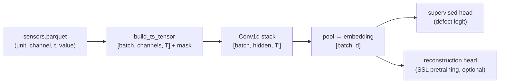

Details that matter:

- **Mask-aware NaN handling**: dropouts become an explicit mask channel — missing is *information*, not zero (the same principle as fusion, Chapter 15).
- **Normalization from training stats only** (leakage rule, Chapter 9).
- **Best-validation-epoch selection** (D-029): the small CNN memorizes a few thousand waveforms before the epoch budget ends; under temporal drift the last epoch scored *below chance* on test, so the checkpoint with best validation ROC-AUC is kept instead.
- **Optional SSL pretraining** behind `ts_encoder.ssl_pretrain` (masked reconstruction; compared via `--compare-ssl`). Honest finding recorded in the Phase 4 report: the supervised TS head is ≈ chance under temporal drift on the small profile, and SSL does not rescue it — the TS embedding still contributes to fusion and retrieval.

> **Implementation status:** both detectors: **Implemented and tested**. SSL
> path: **Implemented and tested, optional and disabled by default**.

> **Key takeaways:** waveforms carry the tool-wear physics; a label-free
> statistical detector serves cold start; the CNN contributes embeddings; the
> honest result — supervised TS classification degrades under drift — is
> documented, not hidden.

**Repository paths used:**
`src/factoryguard/models/timeseries/{stat_detector,cnn_encoder}.py`,
`src/factoryguard/data/timeseries.py`, D-029, `reports/evaluation/`.

---

## Chapter 13: Computer Vision and DINOv2

> **What you will learn:** how inspection images are scored, what DINOv2 is,
> why the encoder is frozen, and how weight integrity is enforced.

### Images as tensors

A PNG becomes a `[3, H, W]` tensor (three color channels), resized and
normalized to the encoder's expected statistics. The generator produces
96–pixel crimp images in 8 visual classes with seeded nuisances (lighting,
position) and — for camera-misalignment windows — blur that does **not**
change the label (that's a *data-quality* event, Scenario C).

### CNNs vs Vision Transformers, and what DINOv2 is

Convolutional networks slide small filters over the image; **Vision
Transformers (ViT)** split the image into patches ("tokens") and let every
patch attend to every other. **DINOv2** is a family of ViT encoders
pre-trained *self-supervised* on huge unlabeled image corpora, yielding
general-purpose embeddings that transfer well with little labeled data.

FactoryGuard uses **DINOv2-small, frozen** (`models/vision/dinov2.py`,
**Implemented and tested**, ADR-0018):

- **Frozen encoder**: pretrained weights are never updated. Cheap (only the small head trains), stable, and reproducible.
- **Trained heads**: a linear probe and a k-Nearest-Neighbor (k-NN) probe on the embeddings produce defect scores.
- **Embedding distance** to healthy training images gives the *label-free* image anomaly score — the strongest cold-start component (test ROC-AUC 0.81 on the small profile, per the Phase 4/6 reports).
- **Image-quality scorer** (`models/vision/quality.py`): detects blur/degradation *before* scoring. Its blur threshold has a story (D-027): the initial guessed constant detected 0% of degraded images; it was recalibrated empirically to 90% detection / 15% false-flag, with a regression test.
- **Attribution** (`models/vision/attribution.py`): CLS-attention maps and attention rollout from the frozen encoder show *where* the model looked — geometry-validated in `tests/ml/test_attribution.py`.

### Supply-chain integrity

Pretrained weights are a supply-chain risk. The checkpoint's SHA-256 is
**pinned in code** (`EXPECTED_CHECKPOINT_SHA256` at
`src/factoryguard/models/vision/dinov2.py:33`) and verified before load;
loading is offline-first (weights fetched at build/setup time, never silently
at run time in the Azure design — D-040).

### Why not a VLM?

A Vision-Language Model (an LLM that accepts images) was rejected as the
*primary* scorer (ADR-0018/D-017): no calibrated probabilities, second-scale
latency vs millisecond embeddings, and weaker auditability. A small VLM
remains an **optional, advisory** triage assistant concept (Chapter 21).

GPU use: encoder inference and head training run on CUDA (1,566 img/s on the
GB10); everything falls back to CPU, slower.

> **Key takeaways:** frozen pretrained encoder + small trained heads is the
> calibratable, auditable, cheap design; image quality is checked before
> scoring; weights are checksum-pinned; the VLM-as-scorer temptation was
> explicitly considered and rejected with reasons.

**Repository paths used:**
`src/factoryguard/models/vision/{dinov2,quality,attribution}.py`,
`tests/ml/test_attribution.py`, `tests/unit/test_image_quality.py`, ADR-0018,
D-017/D-027/D-040.

---

## Chapter 14: Graph Features and Root-Cause Context

> **What you will learn:** how relationships become features, why NetworkX is
> enough, and why association is not causation.

### Graphs in one paragraph

A **graph** is nodes (entities) connected by edges (relationships). Here the
nodes are units, tools, machines, operators, lots, products; typed, timestamped
edges (`src/factoryguard/data/graphdata.py`) record "unit U was crimped by
tool T", "unit U consumed lot L", "unit U was defective (labeled at t)",
"machine M was maintained at t".

### From graph to features (**Implemented and tested**)

`src/factoryguard/features/graph.py` computes, per entity and per moment in
time:

- **time-decayed defect rates** — recent defect evidence counts more than old (exponential decay), smoothed with **Empirical-Bayes (EB)** shrinkage so an entity with 2 units of history isn't scored like one with 2,000;
- **support** (how much history backs the rate) and simple **centrality** (how connected the entity is);
- **supplier-lot risk** resolved through edges — a bad lot shows up across *all* lines consuming it, the one signal purely per-unit features can't see.

All features are bounded [0,1] by construction, and the temporal cutoffs of
Chapter 9 apply strictly (exposure at `produced_at`, evidence at `labeled_at`,
both strictly before the featurization moment).

### Worked example

Three defective units labeled this week on lines L1 and L2. Both consumed
terminal lot `LOT-0007`; the units on L1 also shared tool `T-…-03`, freshly
past maintenance. The graph features respond like this: `LOT-0007`'s decayed
defect rate rises with support 3 (cross-line evidence — strong); the tool's
rate rises with support 2 but its recent-maintenance edge dampens the wear
hypothesis. The root-cause ranker (Chapter 19) therefore ranks the lot above
the tool for the *next* unit consuming `LOT-0007`. That is association: the
correct next step is `inspect_lot` (a recommendation), not a causal verdict.

### Why NetworkX, and why no GNN yet

ADR-0007: at this scale (thousands of nodes) the graph work is edge resolution
and aggregation — **NetworkX** (a pure-Python graph library) does this simply
and portably on ARM64. A **Graph Neural Network** (a model that *learns* over
graph structure) is a documented option with revisit triggers (much larger
graphs, relational patterns the aggregates miss) — **Documented design only**.

Honest finding (OI-6): for *unseen lines*, graph features fall back to priors
(no history), so they help little there; multimodal evidence is what
transfers.

> **Key takeaways:** decayed, smoothed, cutoff-disciplined entity rates turn
> relationships into leak-free features; supplier-lot risk is the flagship
> cross-line signal; association feeds hypotheses and recommendations, never
> causal claims.

**Repository paths used:** `src/factoryguard/features/graph.py`,
`src/factoryguard/data/graphdata.py`, ADR-0007, D-032, OI-6.

---

## Chapter 15: Multimodal Fusion

> **What you will learn:** how four modality scores become one prediction, and
> how missing inputs are handled honestly.

### The problem

Each **modality** (tabular, time series, vision, graph) sees different
physics. No single one suffices: images catch visual defects only for units
*with* images (50% in `tiny`); sensors degrade under drift; tabular misses
cross-line lot effects. Fusion must combine them **and** survive any subset
being absent.

### Two fusion designs (ADR-0006, both **Implemented and tested**)

**Late fusion — the default** (`models/fusion/late.py`): each modality first
produces its own *calibrated* score; a small logistic meta-model (trained on
the validation split) combines `[score_tab, score_ts, score_vis, score_graph]`
+ an **availability mask** + uncertainty proxies.

Numerical feel (illustrative numbers): calibrated scores
`tab=0.62, ts=0.55, vis=0.81, graph=0.58`, all available → the meta-model,
having learned vision is reliable when present, outputs ≈0.7. Same unit
without an image → inputs `[0.62, 0.55, ∅, 0.58]`, mask `[1,1,0,1]` → the
meta-model redistributes weight → ≈0.6 with wider uncertainty. The mask is a
*feature*: the model learns what absence itself implies.

**Embedding fusion — the challenger** (`models/fusion/embedding.py`): fuse
*embeddings* (not scores) through gated projections, with **learned absent
embeddings** — a trainable vector stands in for a missing modality, because
zeros would falsely mean "measured and normal".

**Modality dropout**: during training, modalities are randomly hidden so both
fusers *practice* missingness (acceptance criterion 29). Missing-modality
robustness is a standing evaluation slice (dashboard tab shows ROC-AUC with
each modality dropped).

Honest finding: the winner flips between profiles (small: embedding 0.64 >
late 0.54; medium: late 0.60 > embedding 0.56 test ROC-AUC) — late fusion
stays the default per ADR-0006; embedding remains the challenger.

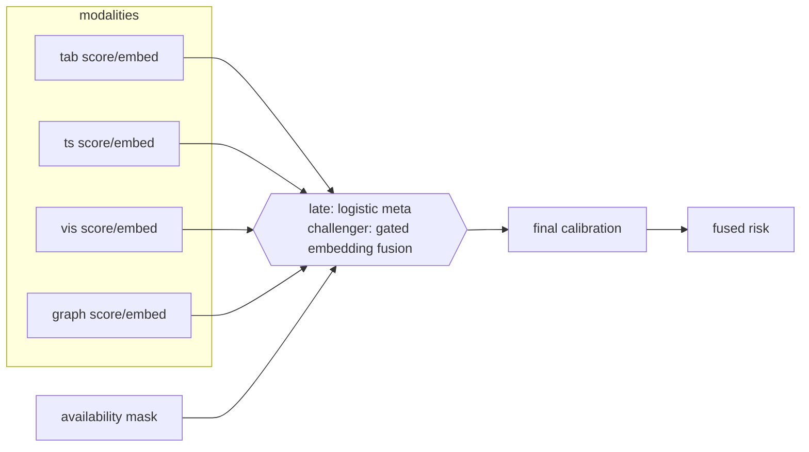

> **Common mistake:** imputing a missing modality with zeros or means. Zero is
> a *legal measured value*; absence must travel as absence (mask / learned
> absent embedding), or the model conflates "no image" with "perfect image".

> **Key takeaways:** calibrate-then-combine (late) is the transparent default;
> embedding fusion is the higher-capacity challenger; masks + modality dropout
> make graceful degradation a *trained* property, tested per slice.

**Repository paths used:** `src/factoryguard/models/fusion/{late,embedding,inputs}.py`,
ADR-0006, `reports/evaluation/*/multimodal-report.md`.

---

## Chapter 16: Serving Modes and Cold Start

> **What you will learn:** how the platform is useful before labels exist, and
> what each serving mode guarantees.

### The label problem

A new deployment has **zero labels** (inspection outcomes arrive days later,
and supervised training needs weeks of them). ADR-0019's answer: three
explicit serving modes, stamped on every response
(`src/factoryguard/inference/serving.py`, **Implemented and tested**).

| Mode | Uses | Output semantics |
|---|---|---|
| `anomaly-only` | label-free components: Isolation Forest (tabular), statistical TS detector, image embedding-distance, graph prior | a **relative risk score** for ranking/triage — *not* a probability; the API says so (`is_probability: false`) |
| `blended` | anomaly components + an immature supervised model | transitional; conservative |
| `supervised` | calibrated fused model | a **calibrated defect probability** with conformal uncertainty |

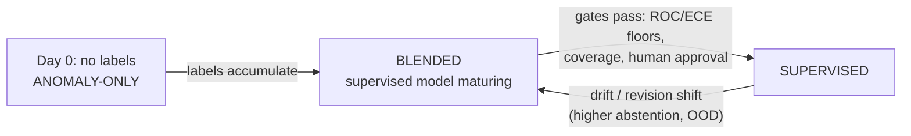

The anomaly-only combination rule is **fixed and documented** (equal weights
by default — honest but not robust to a weak component). Honest finding OI-7:
on the drifted test periods the combined cold-start score is ≈ chance (stat-TS
and graph-prior degrade under drift); **image distance is the only strong
cold-start component (ROC-AUC 0.81)** but covers only units with images.
Phase 6 delivered the hook: `drift_aware_weights` +
weighted `combine_anomaly_scores` (`src/factoryguard/monitoring/drift.py`),
**config-gated, disabled by default** — the documented equal-weight rule
remains the default until an operator opts in.

Cold-start graph prior: `features/graph.graph_prior_scores` supplies
entity-history risk before any model is trained.

> **Why this matters:** conflating an anomaly score with a probability is how
> ranking tools get misused as decision tools. The mode stamp +
> `is_probability` flag + template-summarizer wording ("a ranking signal, not
> a calibrated probability") enforce the distinction at every surface.

> **Key takeaways:** three modes with explicit semantics; cold start is served
> by label-free components of *measured, unequal* quality; the equal-weight
> rule's weakness is documented (OI-7) with a config-gated drift-aware fix.

**Repository paths used:** `src/factoryguard/inference/serving.py`, ADR-0019,
OI-7, `src/factoryguard/monitoring/drift.py`.

---

## Chapter 17: Calibration, Uncertainty, OOD, and Abstention

> **What you will learn:** the difference between a score and a probability,
> and the three safety layers between a model and a confident answer.

### Score → probability: calibration

A model's raw score of 0.9 does not mean 90%. **Calibration** makes
probabilities *mean what they say*: among all units given 0.3, about 30%
should truly be defective. Measured by **reliability diagrams** and **Expected
Calibration Error (ECE** — the average gap between stated confidence and
actual frequency); **Brier score** measures overall probability quality
(mean squared error between predicted probability and outcome).

Implementation (`src/factoryguard/models/calibration/scaling.py`,
**Implemented and tested**, D-028): **Platt scaling** — fit `σ(a·logit(p)+b)`
on the calibration split — with the slope constrained `a>0` (a noisy
calibration slice once *inverted* the ranking: test ROC-AUC 0.71→0.29 before
the constraint); **isotonic regression** (a flexible monotone fit) is used
above a minimum-sample threshold. Why not plain temperature scaling: the base
models train with balanced class weights, centering raw scores near 0.5 at 5%
prevalence — a *bias*, which temperature (a slope-only correction) cannot
remove.

Measured effect (committed report, small profile): tabular ECE 0.398 → 0.034,
late-fusion Brier 0.28 → 0.05 after calibration
(`reports/evaluation/small/multimodal-metrics.json`).

### Conformal prediction: honest uncertainty

**Split conformal prediction** turns a calibrated model into **prediction
sets** with a coverage guarantee: using a held-out calibration slice
(disjoint "calib-B", so the calibrator's slice isn't reused), it finds the
score threshold such that ~90% of true labels fall inside the emitted set.
Output per unit: `{pass}`, `{defect}`, or the ambiguous `{pass, defect}`.
Measured empirical coverage on this project: 0.87–0.88 against the 0.9 target
(honestly reported).

### Mahalanobis OOD

**Out-of-Distribution (OOD)** detection asks "is this input even from the
world I trained on?" — **Mahalanobis distance** measures how far a unit's
embedding sits from the training distribution, accounting for correlations. A
new product revision (Scenario D) shows up here first.

### Abstention

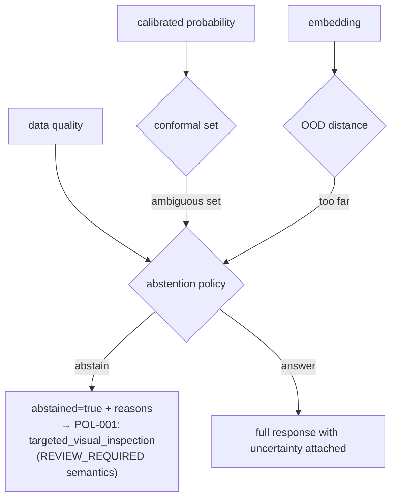

The abstention policy (`src/factoryguard/inference/uncertainty.py`,
**Implemented and tested**) refuses to answer confidently when the conformal
set is ambiguous, the input is OOD, or data quality failed — with machine-
readable reasons. **Risk–coverage curves** (answer fewer → be more accurate)
quantify the trade and render on the dashboard.

Five distinct things, never to be conflated: raw score < calibrated
probability < conformal set < OOD flag < the final decision-confidence the
policy acts on.

> **Why this matters:** a model that must always answer will confidently
> mislabel the inputs it understands least. Abstention converts "silent wrong
> answer" into "flagged human review" — the cheapest safety mechanism in the
> entire system.

> **Key takeaways:** Platt/isotonic calibration with a positive-slope guard;
> conformal sets with measured (slightly-under-target, honestly reported)
> coverage; Mahalanobis OOD; an abstention policy that routes to humans.

**Repository paths used:** `src/factoryguard/models/calibration/scaling.py`,
`src/factoryguard/inference/uncertainty.py`, D-028,
`reports/evaluation/small/multimodal-metrics.json`.

---

## Chapter 18: Evaluation Framework

> **What you will learn:** how models are tested so the numbers can be
> believed, and what every metric means.

### Split design (**Implemented and tested**, `evaluation/splits.py` + 8 leakage tests)

- **Temporal splits**: train on the past, test on the future — always.
- **Group-aware splits**: keep a work order's units on one side of the boundary (they share causes).
- **Slices**: unseen-line transfer, drifted periods, missing-modality ablations, per-severity recall, cold-start components — each reported separately, because aggregates hide failures.

### The metric zoo, briefly

Confusion-matrix family (defect = "positive"): **precision** (of flagged
units, how many truly defective), **recall** (of truly defective, how many
flagged), **F1** (their harmonic mean), **MCC** (Matthews correlation —
balanced single number robust to imbalance), **false negatives per million**
(escaped defects, the costly direction), **recall @ fixed false-positive
rate** (what inspection capacity actually allows). Threshold-free ranking:
**ROC-AUC** (probability a random defect outranks a random pass — 0.5 =
chance) and **PR-AUC** (precision-recall area — the honest one at 5%
prevalence). Probability quality: **Brier**, **ECE** (Chapter 17). Forecast:
**MAE/RMSE/MAPE** (mean absolute / root-mean-squared / mean-absolute-
percentage error). Ranking (root cause & retrieval): **Recall@K** (truth in
top K?), **MRR** (mean reciprocal rank of the truth), **NDCG@K** (graded,
position-discounted relevance). Serving: **P50/P95/P99 latency** percentiles
(measured 43/56/57 ms in-process on the GB10).

Why aggregate accuracy lies: a model can improve overall ROC-AUC while its
recall on a rare-but-critical severity class collapses — which is precisely
**Scenario G**: a candidate with better aggregate metrics but worse
critical-defect recall **must fail promotion**. The promotion gates
(`configs/policies/promotion.yaml`) encode floors (test ROC-AUC ≥ 0.52, ECE ≤
0.10, conformal coverage ≥ 0.80), manifest verification, champion comparison,
and a required human approver — and the Phase 6 retraining run demonstrated a
real rejection (tiny candidate at ROC 0.389 < floor, decision recorded).

> **Key takeaways:** time-respecting, group-aware, slice-reported evaluation;
> metrics chosen for 5% prevalence; promotion is gated on floors + slices +
> human approval, and the gates have already rejected a real candidate.

**Repository paths used:** `src/factoryguard/evaluation/{splits,metrics}.py`,
`tests/ml/test_splits.py`, `configs/policies/promotion.yaml`,
`docs/test-evidence.md` (Phase 6 rejection).

---

## Chapter 19: Explainability

> **What you will learn:** the strict ladder from prediction to
> recommendation, and what each explanation artifact actually is.

The ladder, each rung with different epistemic status:

1. **Prediction** — a number (Chapter 17 tells you how much to trust it).
2. **Attribution** — which *inputs* moved this prediction: tabular feature importances; time-series influential intervals (which part of the waveform deviates from the healthy envelope); vision CLS-attention/rollout maps (`models/vision/attribution.py`, geometry-validated); fusion modality contributions (late fusion's meta-weights over the availability mask make this directly readable).
3. **Association** — which *entities* co-occur with elevated risk (graph features).
4. **Similarity** — `inference/retrieval.py` finds nearest historical incidents in the **concatenated per-modality embedding space** (D-030 — the fused embedding collapsed defect-*category* structure and made retrieval worse than a frequency baseline; concatenation fixed it: precision@5 0.129/0.176 vs baseline 0.087 on small/medium).
5. **Root-cause hypothesis** — `explainability/root_cause.py` ranks candidate entities by decayed history + mechanism-shaped evidence. Because the generator wrote latent truth, ranking quality is *measured*: hit@3 0.36, hit@5 0.50, MRR 0.32 over 110 units (medium profile) — far better than chance, far from perfect, honestly reported.
6. **Recommendation** — Chapter 20; deterministic policy, not ML.

Language discipline (enforced by the assistant validator and template
wording): ✅ "Top-ranked cause hypothesis: tool T-… (statistical association,
not causal proof)". ❌ "The defect was caused by tool T-…". The system never
has evidence for the second sentence.

> **Key takeaways:** explanation artifacts form a ladder of decreasing
> certainty; root-cause ranking is *scored against ground truth* — rare and
> only possible because the data is synthetic; causal wording is forbidden by
> validators, not just convention.

**Repository paths used:** `src/factoryguard/explainability/root_cause.py`,
`src/factoryguard/models/vision/attribution.py`,
`src/factoryguard/inference/retrieval.py`, D-030.

---

## Chapter 20: Recommendation Engine

> **What you will learn:** how predictions become auditable human actions —
> deterministically.

### Why deterministic

Given the same prediction, the same recommendations must come out — reviewable
like a spec, testable like code, auditable after an incident. **No ML and no
LLM sits in this path** (**Implemented and tested**,
`src/factoryguard/recommendations/engine.py`).

The 9-action allow-list (`ACTION_TAXONOMY`, engine.py lines 28–40):
`inspect_lot`, `verify_crimp_height`, `check_tool_wear`,
`validate_calibration`, `review_first_piece_approval`,
`targeted_visual_inspection`, `review_maintenance`, `hold_unit`, `escalate`.
Anything else is rejected — including by the assistant-output validator
(Chapter 21), so even a hallucinating LLM cannot inject a new action string.

Policies (in code, with IDs): POL-001 abstention/data-quality → targeted
visual inspection; POL-002 degraded capture chain → validate calibration;
POL-003…006 root-cause-directed checks (tool → `check_tool_wear`, lot →
`inspect_lot`, …); POL-007 calibrated high probability → `hold_unit`
(approval-gated); POL-008 escalation. Every recommendation carries evidence
references, severity, and — for `hold_unit`/`escalate` — a required approver
role and `PENDING_APPROVAL` status (ADR-0017: a human authorizes, always).

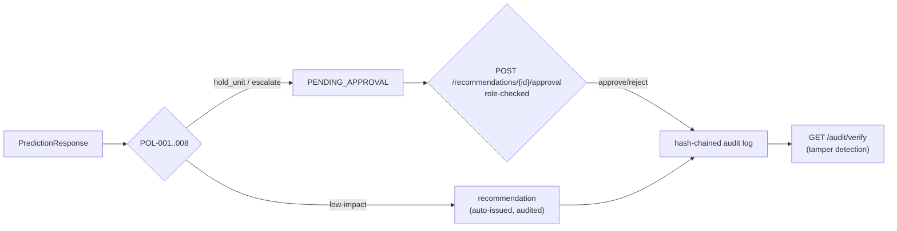

The **audit log** (`recommendations/audit.py`) is append-only and
hash-chained: each entry contains the hash of the previous one, so silent
edits break the chain — `GET /api/v1/audit/verify` proves integrity on demand
(tamper-detection is tested).

Rejection example: if a policy (or anything else) tried to emit action
`"restart_machine"`, the taxonomy check refuses it — that string simply is not
in the allow-list, and the assistant validator would likewise flag it
(`tests/unit/test_assistant.py` exercises exactly this case).

> **Key takeaways:** a fixed taxonomy, deterministic policies, human approval
> for high-impact actions, and a tamper-evident audit trail — the layer where
> "advisory-only" becomes machinery.

**Repository paths used:** `src/factoryguard/recommendations/{engine,audit}.py`,
ADR-0017, `tests/unit/test_recommendations.py`.

---

## Chapter 21: Optional Assistant Layer

> **What you will learn:** how generative text is allowed near the system —
> and every fence around it.

Four summarizer options (`src/factoryguard/assistants/summarizer.py`):

| Generator | What it is | Status |
|---|---|---|
| `TemplateSummarizer` | deterministic sentences assembled from response fields | **Implemented and tested** — the default and permanent fallback |
| `SlmSummarizer` | optional on-box Small Language Model wrapper | **Implemented but not fully tested** — runtime intentionally absent; falls back (tested) |
| `FoundrySummarizer` | optional hosted **Claude Fable 5** via Microsoft Foundry | **Implemented and tested at the fallback/validation level; never executed against a real endpoint** (SDK unpinned, OI-11) |
| local VLM triage (Scenario J) | image-triage assistant concept | **Documented design only** (ADR-0020) |

The fences (D-033 — structural, not aspirational):

1. **Structured evidence only.** Generators receive fields of the already-assembled response (`FoundrySummarizer._evidence` serializes an enumerated allow-list of fields). There is **no caller-text path** into any prompt — prompt injection from request payloads is removed *by construction*.
2. **Every output validated** by `validate_assistant_output`: entity IDs mentioned must exist in the response evidence; action-like tokens must be in the taxonomy; probability language is forbidden outside supervised mode (except the exact disclaimer phrase). Any violation → the template output is served instead.
3. **Fallback, never silence, never unvalidated text**: SDK missing, credentials missing, network failure, model refusal (`stop_reason != "end_turn"`) — all serve the template (D-041 deliberately chains to the *deterministic* fallback, not to a second generative model).
4. **Contractually advisory**: `AssistantOutput.advisory` is `Literal[True]` in `contracts/v1.py` — a type-level guarantee; nothing parses assistant text back into decisions.
5. **Fully optional**: with no assistant configured, the platform is complete.

Scenario J (VLM triage of an abstained image) is **not implemented** — it
remains an ADR-0020 design sketch. This tutorial will not pretend otherwise.

> **Security note:** the threat here is prompt injection — attacker-controlled
> text steering the model. The defense is not filtering the text but *never
> letting caller text reach the model*, and validating everything that comes
> back against allow-lists derived from the response itself.

> **Key takeaways:** generative text is display-layer garnish with five
> independent fences; the deterministic template is both default and fallback;
> the Foundry path is wired, tested for its failure modes, and dormant.

**Repository paths used:** `src/factoryguard/assistants/summarizer.py`,
`src/factoryguard/contracts/v1.py`, `tests/unit/test_assistant.py`, ADR-0020,
D-033/D-041, `docs/operations/foundry-integration.md`.

---

## Chapter 22: API Design

> **What you will learn:** every endpoint the service exposes, the order in
> which middleware processes a request, and why hardening runs *before* any
> model code.

### The application entrypoint

`apps/api/main.py` is a thin wrapper: it calls `create_app()` in
`src/factoryguard/api/app.py`, which loads settings, builds the token verifier,
attempts to load the champion model bundle into `app.state.service`, and wires
the middleware stack and routers. The business logic lives in the library; the
app module only assembles it (**Implemented and tested** — live `uvicorn` boot
verified in Phase 5, `docs/test-evidence.md`).

### The endpoints

Routes are defined in `src/factoryguard/api/routes.py`. Two are anonymous;
every other route declares a required scope via `Depends(require("<scope>"))`
and is deny-by-default.

| Method + path | Scope required | Purpose |
|---|---|---|
| `GET /health/live` | (anonymous) | liveness — process is up |
| `GET /health/ready` | (anonymous) | readiness — model bundle loaded (else 503) |
| `GET /version` | (anonymous) | app version, schema version, served model version |
| `POST /api/v1/predictions` | `predictions:write` | score one unit → `PredictionResponse` |
| `POST /api/v1/predictions/batch` | `predictions:write` | score up to `_MAX_BATCH = 100` units |
| `GET /api/v1/predictions/{id}` | `predictions:read` | retrieve a prior prediction |
| `POST /api/v1/feedback` | `feedback:write` | submit an inspection outcome (tomorrow's label) |
| `GET /api/v1/models/current` | `models:read` | current served model descriptor |
| `GET /api/v1/models/{version}/card` | `models:read` | model card |
| `GET /api/v1/monitoring/summary` | `monitoring:read` | monitoring rollup |
| `GET /api/v1/data-quality/summary` | `data-quality:read` | data-quality rollup |
| `POST /api/v1/recommendations/{id}/approval` | `recommendations:approve` | approve/reject a pending high-impact action |
| `GET /api/v1/audit/verify` | `audit:read` | verify the hash-chained audit log |

The `/metrics` Prometheus endpoint is served separately (Chapter 26).

### Middleware order — hardening first

The middleware order is the security spine, and it is deliberate. In
`app.py`, middleware are added in an order that makes them execute
outermost-first per request:

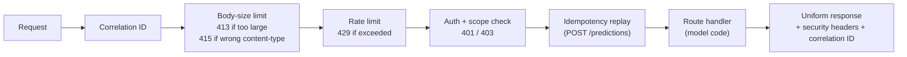

The Phase 5 security suite proves this order empirically (`docs/test-evidence.md`):
a 401/403 is returned *before any model code runs*, an oversized body gets 413,
a wrong content type 415, over-limit requests 429, and — when the model bundle
is absent — the service returns **503, not 500** (`_service()` in `routes.py`
raises `HTTPException(503, ...)`). Every response carries a correlation ID and
security headers; validation errors return field paths only, never the offending
input values.

### Idempotency and correlation

`POST /api/v1/predictions` honors an `Idempotency-Key` header: a replayed key
returns the cached response with `Idempotency-Replayed: true` and the same
`prediction_id` (verified in the e2e suite). The idempotency cache
(`IdempotencyCache` in `middleware.py`) is bounded (`max_entries=1024`).

> **Honest limitation (OI-8):** serving state — the prediction log, feedback,
> idempotency cache, and rate-limit windows — is **in-memory plus JSONL per
> process**. The compose stack's PostgreSQL is **not yet wired into the API**. A
> restart loses the in-memory prediction index (the JSONL log survives). This is
> fine for the single-process local deployment and is recorded as an open issue,
> not hidden.

> **Key takeaways:** two anonymous health/version routes plus eleven
> scope-guarded API routes; middleware runs hardening (correlation → size/type →
> rate limit → auth → idempotency) before any model code; absent artifacts fail
> as 503, and this ordering is proven by the security test suite.

**Repository paths used:** `src/factoryguard/api/{routes,middleware,app,deps,metrics}.py`,
`apps/api/main.py`, `tests/end_to_end/test_api_flow.py`, `docs/test-evidence.md`.

---

## Chapter 23: Authentication and Authorization

> **What you will learn:** how a caller proves who it is, how roles become
> scopes, and why the same authorization tests protect both the local and the
> Azure path.

### Authentication: who are you?

A caller presents a **bearer token** — a JSON Web Token (JWT), a signed,
tamper-evident bundle of claims. `get_principal` in
`src/factoryguard/api/deps.py` extracts the `Authorization: Bearer <token>`
header, rejects a missing/malformed header with 401, and hands the token to a
`TokenVerifier`.

Two verifiers exist (`src/factoryguard/auth/verifier.py`, ADR-0010):

| Verifier | Algorithm | Where | Status |
|---|---|---|---|
| `LocalJwtVerifier` | HS256 | dev only — tokens from `scripts/issue_dev_token.py` | **Implemented and tested**; forbidden in hardened envs by fail-closed config |
| `EntraIdVerifier` | RS256 via OIDC/JWKS | Azure (Entra ID) | **Implemented but not executed** — structurally identical claims→roles→scopes path; never run against a real tenant |

Both pin their algorithm and require `exp`, `iss`, `aud`, and `sub` claims. The
algorithm pinning matters: the Phase 5 auth tests prove that an `alg: none`
token, a wrong-audience token, and an expired token are all rejected — the
classic JWT downgrade attacks fail closed.

### Authorization: what may you do?

Roles map to scopes in exactly **one place** — `ROLE_SCOPES` in `verifier.py`.
There are **seven roles** (the authorization model from Chapter 1):

| Role | Scopes (abbreviated) |
|---|---|
| `platform-admin` | all eight scopes |
| `ml-engineer` | predictions r/w, models, monitoring, data-quality |
| `quality-engineer` | predictions r/w, feedback, **recommendations:approve**, monitoring, data-quality |
| `data-steward` | data-quality, feedback, monitoring |
| `plant-viewer` | predictions:read, monitoring |
| `auditor` | audit:read, monitoring, models |
| `service` | predictions:write, feedback:write (machine-to-machine) |

`scopes_for_roles` unions the scopes for a token's roles; **unknown roles grant
nothing** (deny-by-default). A route's `require("scope")` dependency returns 403
if the principal lacks the scope, and logs `subject + path + scope + decision`
— **token contents never appear in logs**. The e2e suite proves a
`plant-viewer` gets 403 on the approval route.

Because `EntraIdVerifier` produces the same `Principal` shape from the same
`roles` claim, the identical authorization tests cover both providers — the only
untested part of the Azure path is the network round-trip to fetch signing keys,
which cannot run here (no tenant, no credentials).

> **Security note:** the local HS256 verifier is a development convenience and
> is **forbidden** in staging/production by `_fail_closed` (Chapter 6): a
> hardened environment configured with `provider: local` or `auth.enabled:
> false` refuses to start.

> **Key takeaways:** JWT bearer auth with pinned algorithms and required
> claims; seven roles mapped to scopes in a single table; deny-by-default with
> unknown-role-grants-nothing; the dev verifier is fenced out of production by
> fail-closed config; the same tests guard both providers.

**Repository paths used:** `src/factoryguard/auth/verifier.py`,
`src/factoryguard/api/deps.py`, `scripts/issue_dev_token.py`, ADR-0010,
`configs/environments/production.yaml`, `docs/test-evidence.md`.

---

## Chapter 24: Dashboard

> **What you will learn:** what the operator dashboard shows, how it reads its
> data, and the boundary between display and decision.

### What it is

`apps/dashboard/main.py` is a **Streamlit** application — a Python framework
that renders widgets from top-to-bottom script execution. It is the
plant-facing view: model health, uncertainty, root cause, and a live demo
prediction (**Implemented and tested (smoke)** — an `AppTest` smoke test runs in
the e2e suite, `tests/end_to_end/test_dashboard.py`).

### The four tabs

A sidebar profile selector drives everything; the dashboard reads the committed
evaluation metrics for the chosen profile and stamps the **serving mode** in the
sidebar. The four tabs (`st.tabs`):

1. **Overview** — fusion performance for the test period (four headline
   metrics), a per-modality calibrated table, and a **missing-modality
   robustness** table (ROC-AUC with each modality dropped — the trained
   graceful-degradation property from Chapter 15).
2. **Uncertainty** — abstention/coverage headline metrics and the
   **risk–coverage curve** (answer fewer → be more accurate; Chapter 17).
3. **Causes** — root-cause hypotheses and similar-incident retrieval panels.
4. **Predict** — an **in-process demo prediction**: it loads the champion
   bundle with a cached `PredictionService`, lets the user pick a unit from the
   generated `data/<profile>/tables/units.parquet`, scores it, and displays the
   full response including the **advisory-marked** assistant summary.

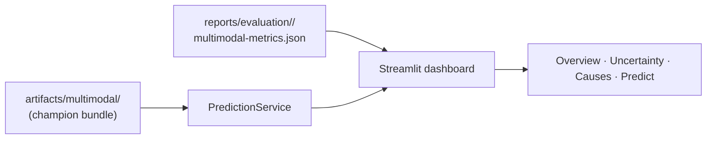

### Display, not decision

The dashboard **displays** predictions and lets an authorized user trigger a
demo score; it does not make or approve decisions on its own. High-impact
actions still flow through the approval endpoint (Chapter 20). A real story from
Phase 5 (`docs/test-evidence.md`): a `row.shift` attribute access collided with
pandas' `.shift()` method — request builders must use `row["shift"]`. It was
caught while smoke-testing and fixed.

If no metrics or artifacts exist for the chosen profile, the dashboard shows an
informational message and stops — it never invents data.

> **Key takeaways:** a four-tab Streamlit operator view driven by committed
> metrics and the champion bundle; it surfaces performance, uncertainty, and
> root cause and runs a live demo prediction, but it is a display surface —
> decisions and approvals happen through the audited API.

**Repository paths used:** `apps/dashboard/main.py`,
`tests/end_to_end/test_dashboard.py`, `reports/evaluation/`,
`artifacts/multimodal/`.

---

## Chapter 25: Experiment Tracking and Model Registry

> **What you will learn:** how every training run is recorded, how a model is
> promoted through gated stages, and why the gates are code this project owns.

### Tracking with MLflow

**MLflow** is an experiment-tracking system: each training run logs parameters,
metrics, tags, and artifacts to a backing store.
`src/factoryguard/mlops/tracking.py`'s `log_training_run` is wired into
`train_multimodal` and records (**Implemented and tested**):

- **params** (profile, config),
- **headline metrics** (fusion ROC-AUC, ECE, coverage, …),
- **tags**: git commit, feature versions, and the **artifact manifest SHA-256**
  (`artifact_manifest_sha256`) — so a run points at the exact checksummed bundle,
- **artifacts**: the evaluation report, the metrics JSON, and a **generated
  model card**.

The default backend is a **local serverless sqlite** store
(`sqlite:///mlruns/mlflow.db`) — chosen after MLflow 3.14 rejected the plain
file store (D-034). Phase 6 verified tracking **twice**
(`docs/test-evidence.md`): the local sqlite store *and* the compose MLflow
**server** (PostgreSQL backend, MinIO artifact store) — one server-side run
holds metrics plus three artifacts.

### The registry and its gates

The registry (`src/factoryguard/mlops/registry.py`, ADR-0005/0017) is a
**file-backed registry this project owns** deliberately, so the promotion gates
are testable code rather than an opaque service feature. The lifecycle:

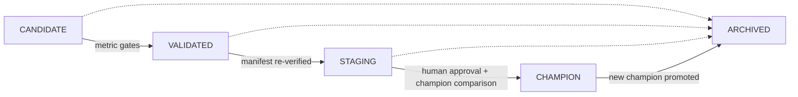

The gates come from `configs/policies/promotion.yaml` (thresholds in config,
not code — Chapter 6):

| Stage | Gate |
|---|---|
| VALIDATED | test ROC-AUC ≥ 0.52, test ECE ≤ 0.10, conformal coverage ≥ 0.80 |
| STAGING | artifact manifest re-verified |
| CHAMPION | recorded human approval by role `ml-engineer` **and** a stored champion-comparison record |

**Exactly one CHAMPION exists at a time**; promoting a new one archives the
previous. `champion_path()` is what serving loads (`model.serving_alias =
champion`). Every state transition and approval is written to a **hash-chained
audit log** (the same construct as the recommendation audit, Chapter 20).

Phase 6 **live-verified** the whole path (`docs/test-evidence.md`): a small
bundle went CANDIDATE → VALIDATED → STAGING → approved → CHAMPION with an
8-entry verified audit chain, and API startup logged that it was serving the
registry champion. Critically, the gates **rejected a real weak candidate** —
the tiny-profile candidate at ROC 0.389 < the 0.52 floor — proving the gate is
not decorative.

> **Key takeaways:** every run is tracked (params, metrics, git commit, manifest
> digest, model card) to sqlite or the compose MLflow server; promotion runs
> through owned, tested gates (metric floors → manifest verify → human approval +
> champion comparison); exactly one champion serves; the gates have already
> rejected a real candidate.

**Repository paths used:** `src/factoryguard/mlops/{tracking,registry}.py`,
`configs/policies/promotion.yaml`, ADR-0004, ADR-0005, D-034,
`docs/test-evidence.md`.

---

## Chapter 26: Monitoring and Observability

> **What you will learn:** the three observability pillars this system emits,
> what is measured, and the one deliberate anonymous exception.

### The three pillars

**Metrics** (aggregate numbers over time), **logs** (structured event records),
and **traces** (the path of one request through the code) are the three pillars.
FactoryGuard implements all three (**Implemented and tested** — the full
Prometheus loop was live-verified in Phase 6).

### Metrics — Prometheus

`src/factoryguard/api/metrics.py` exposes a Prometheus `/metrics` endpoint (when
`monitoring.metrics_enabled`) with these series:

| Series | Type | Labels |
|---|---|---|
| requests total | Counter | method, route, status |
| request latency | Histogram | route |
| predictions total | Counter | serving_mode, abstained |
| risk score | Histogram | — |

Two design details matter. First, **label cardinality is bounded**: the metrics
middleware collapses dynamic path segments (e.g. `/predictions/{id}`) to a
static route label so an attacker cannot explode the metric space with unique
IDs. Second, `/metrics` is the **one documented anonymous endpoint exception** —
scrapers reach it without a token, by design, and it exposes only aggregate
counters, never payload contents.

Phase 6 proved the loop end to end (`docs/test-evidence.md`): the host API on
`:8010` was scraped `up` by the **containerized Prometheus**
(`up{job="factoryguard-api-host"} = 1`), and Grafana rendered the provisioned
FactoryGuard dashboard (`infrastructure/compose/grafana/`).

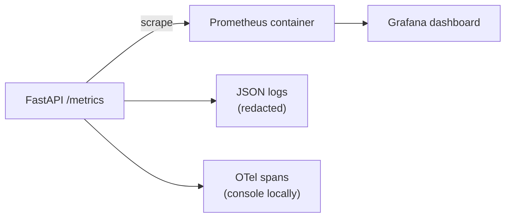

### Logs and traces

Structured **JSON logging** with secret redaction and correlation IDs lives in
`src/factoryguard/utilities/logging.py` (D-037); every request carries a
correlation ID (Chapter 22) so a log line ties to a response.
`src/factoryguard/utilities/tracing.py` sets up **OpenTelemetry (OTel)** tracing.

> **Status honesty:** OTel tracing uses the **console exporter locally**
> (verified); the **OTLP exporter is not pinned** and the collector wiring is
> part of the (unexecuted) Azure design — **Not executed**. Azure Monitor / App
> Insights ingestion is documented, never run.

### The port story

Port 8000 was occupied on the dev box by an unrelated service, so the host
scrape target moved to **8010** — no foreign process was touched
(`docs/test-evidence.md`). A small but honest operational fact.

> **Key takeaways:** Prometheus metrics with bounded cardinality and one
> deliberate anonymous scrape endpoint; redacted JSON logs with correlation IDs;
> OTel traces via the console exporter locally, with OTLP/Azure ingestion
> documented but unexecuted; the Prometheus→Grafana loop is live-verified.

**Repository paths used:** `src/factoryguard/api/metrics.py`,
`src/factoryguard/utilities/{logging,tracing}.py`,
`infrastructure/compose/prometheus.yml`, `infrastructure/compose/grafana/`,
D-037, `docs/test-evidence.md`.

---

## Chapter 27: Drift Detection and Retraining

> **What you will learn:** how the system notices the world has changed, the
> exact rule that triggers a retraining candidate, and why nothing ever
> auto-deploys.

### What drift is

**Drift** is a change between the world a model was trained on and the world it
now serves. The drift suite (`src/factoryguard/monitoring/drift.py`,
**Implemented and tested**, ADR-0016) measures three kinds:

- **Feature drift**: PSI (Population Stability Index) plus Jensen–Shannon, KS,
  and Wasserstein for numeric columns; categorical PSI over category
  frequencies. PSI drives the severity label.
- **Embedding drift**: fits Mahalanobis on the reference embeddings, scores both
  sets, and reports the **tail mass** beyond the reference p99 (units drifting
  far from the training distribution).
- **Calibration drift**: ECE/Brier of recent labeled predictions vs the
  baseline calibration-period values.

Thresholds live in `configs/policies/drift.yaml` (PSI moderate 0.10, major
0.25).

### The sustained-breach rule

A retraining **candidate** is proposed only when the breach rule fires
(`breach_detected` in `pipelines/retraining/check_and_retrain.py`): at least
`min_major_features` (3) features major-drifted, **or** embedding tail mass >
`embedding_tail_max` (0.05), **or** ECE degrades by more than `ece_delta_max`
(0.05).

A crucial subtlety (D-036): **consumable-lot identity columns are excluded**
from the breach rule. `terminal_lot_id` and `wire_lot_id` churn completely
between windows *by design* — lots get used up — so their high PSI is expected
turnover, not model-relevant drift. They still appear in the report for
transparency, but do not trigger retraining. In the Phase 6 drift run,
`terminal_lot_id` had PSI 34.6 (pure consumable churn) alongside genuine drift
like `tool_age_cycles` PSI 7.9.

### Retraining that never auto-deploys

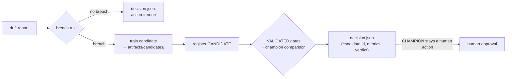

The pipeline reads the latest drift report, applies the breach rule, trains a
candidate on breach (or `--force`), registers it as CANDIDATE, attempts the
VALIDATED gate, records the champion comparison, and writes a **decision file**
— but **CHAMPION promotion remains a human action**. Phase 6 live-verified this
with a real breach (16 major features + 95.2% embedding tail): a candidate was
trained, registered, compared, and **rejected by the gates**, with the reason
recorded in `reports/retraining/tiny/decision.json`. The governance path works;
nothing auto-deploys.

> **Note on the worker:** `apps/worker/` contains only `__init__.py` — there is
> **no standing daemon**. Drift and retraining run as pipeline invocations
> (`pipelines/monitoring/drift_report.py`, `pipelines/retraining/check_and_retrain.py`),
> not a long-running process. This is honest current state, not a hidden gap.

> **Key takeaways:** drift is measured three ways (feature/embedding/calibration)
> with config thresholds; a sustained-breach rule that excludes consumable churn
> triggers a candidate; retraining proposes and gates but never promotes — the
> champion is always a human decision, and a real candidate has already been
> rejected.

**Repository paths used:** `src/factoryguard/monitoring/drift.py`,
`pipelines/retraining/check_and_retrain.py`, `configs/policies/drift.yaml`,
D-036, ADR-0016, `docs/test-evidence.md`.

---

## Chapter 28: Security Architecture

> **What you will learn:** the defense-in-depth layers that are actually in
> code, the zero-trust design for Azure, and — plainly — what security
> documentation does not yet exist.

### The implemented layers

Security in this project is enforced in code, not just promised. The layers you
have already met, all **Implemented and tested**:

| Layer | Mechanism | Chapter |
|---|---|---|
| Configuration | `_fail_closed` refuses to start hardened envs with any insecure combination | 6 |
| Authentication | JWT bearer, pinned algorithms, required claims | 23 |
| Authorization | 7 roles → scopes, deny-by-default, unknown-role-grants-nothing | 23 |
| Request hardening | body-size (413), content-type (415), rate limit (429), correlation IDs, uniform safe errors | 22 |
| Secret redaction | key- and pattern-based (`src/factoryguard/security/redaction.py`) | 26 |
| Artifact integrity | SHA-256 checksum-before-deserialize (`src/factoryguard/security/checksums.py`) | 29 |
| Advisory boundary | allow-listed actions, human approval, `advisory: Literal[True]` | 1, 20, 21 |
| Audit | hash-chained, tamper-evident logs | 20, 25 |

The **redaction** module has two layers: key-based (any mapping key that looks
sensitive) and pattern-based (values that look like tokens/keys/connection
strings), applied recursively to logs and error payloads. **Checksums** treat
artifacts as untrusted until verified: `sha256_tree` and `write_manifest`/
`verify_manifest` are the gate every artifact bundle passes (Chapter 29).

### The zero-trust Azure design

`docs/architecture/security-architecture.md` describes the target posture
(**Documented design only** for the parts requiring cloud; the identity model is
implemented in Bicep — Chapter 38): no public endpoints (ADR-0011), **no shared
credentials anywhere**, deny-by-default authorization at every layer, and
fail-closed configuration. Every managed identity is a UAMI or system-assigned
MSI; **no service principal with a client secret exists in the design**; CI
reaches Azure only through GitHub OIDC workload-identity federation.

### What is honestly missing

> **Status honesty (Phase 8 gap):** `docs/security/` is **empty**. There is
> **no threat model document** yet — `SECURITY.md` even points readers to
> `docs/security/` for one, and it is not there. `PLAN.md`'s acceptance
> criterion 22 ("Threat model + RAI docs") is **pending**. Likewise
> `docs/responsible-ai/` is **empty**: dataset cards exist per generated dataset
> and a model card is generated as an MLflow artifact (Chapter 25), but there is
> **no standing responsible-AI document set**. These are Phase 8 work, not done.
> This tutorial does not paper over that.

The security *test suite* also has planned-but-unwritten parts: `PLAN.md` Phase 8
lists path-traversal, malformed-image, and failure-injection tests as pending,
beyond the 12 API-security behaviors already tested in Phase 5.

> **Key takeaways:** the security spine — fail-closed config, JWT auth, scoped
> authz, request hardening, redaction, artifact integrity, audit, advisory
> boundary — is implemented and tested; the Azure zero-trust identity model is
> designed and encoded in Bicep; but the threat model and responsible-AI
> document sets are **empty Phase 8 gaps**, stated plainly.

**Repository paths used:** `docs/architecture/security-architecture.md`,
`SECURITY.md`, `src/factoryguard/security/{checksums,redaction}.py`,
`src/factoryguard/api/middleware.py`, `docs/security/` (empty),
`docs/responsible-ai/` (empty), `PLAN.md`.

---

## Chapter 29: Secure Software Supply Chain

> **What you will learn:** how dependencies, code, and images are checked before
> they ship — and which of those checks have actually run.

### Pinned, co-resolved dependencies

Every dependency is pinned in `requirements/lock.txt` (pip-compile, fully
co-resolved) plus `requirements/torch.txt` (the CUDA wheel index). Two real
resolution conflicts were fixed while building the lock (cryptography 49 vs
mlflow's cap; pandas 3 vs mlflow's `pandas<3`) — recorded in Phase 1 evidence.
The one deliberate exception: the `anthropic` SDK is **intentionally not pinned**
(OI-11) — `FoundrySummarizer` lazy-imports it and falls back to the template
when it is absent (Chapter 21, 36).

### Safe deserialization (ADR-0012)

Pickle-based formats are code-execution vectors. The rules:

- **Torch models**: `state_dict` as safetensors + a JSON architecture file;
  `torch.load` is **banned except with `weights_only=True`**, enforced by a
  security test.
- **sklearn models**: joblib pickle is unavoidable, so it is allowed **only** for
  artifacts written by the registry and loaded **only** after SHA-256 manifest
  verification from the registry root — checksum-before-deserialize is mandatory
  and tested (the corrupted-artifact security test). Artifact paths are
  constrained to the registry root (no traversal).

### Pre-commit and CI gates

`.pre-commit-config.yaml` runs hygiene hooks, **ruff** (lint + format),
**detect-secrets** (against `.secrets.baseline`), and **bandit** (SAST) locally.
`.github/workflows/pr.yml` defines three jobs:

| Job | Steps |
|---|---|
| `quality` | ruff, mypy, unit/contract/ml tests, security tests |
| `supply-chain` | detect-secrets, bandit, **pip-audit** (dependency CVEs) |
| `container` | docker build, **trivy** image scan (fail on HIGH/CRITICAL), **syft** SPDX SBOM upload |

Two helper scripts run the container-based scans locally without host installs:
`scripts/sbom.sh` (syft → `sbom/`) and `scripts/scan.sh` (trivy filesystem +
config + image → `reports/security/`).

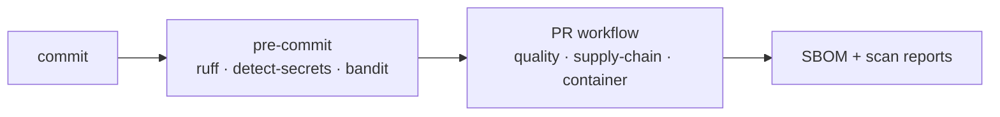

> **Status honesty (OI-4):** `.github/workflows/pr.yml` is **authored and
> locally validated** (YAML parses; the same commands run through `make`) but
> has **never executed on GitHub** — no remote was configured. Treat CI as
> **Defined as configuration, not executed**. The evidence that ruff/mypy/bandit/
> pytest pass is from **local runs** recorded in `docs/test-evidence.md`, not
> from a CI run. `PLAN.md`'s acceptance criterion 15 ("Scans + SBOM integrated")
> is **pending** — the tooling is wired, but SBOM/scan evidence is not yet
> recorded as executed output.

> **Key takeaways:** dependencies are pinned and co-resolved (with one
> deliberately-unpinned optional SDK); deserialization is checksum-gated and
> `weights_only`; pre-commit and a three-job CI workflow define lint/type/test/
> secret/SAST/dependency/image/SBOM gates — locally validated, not yet executed
> on GitHub.

**Repository paths used:** `requirements/lock.txt`, `requirements/torch.txt`,
`.pre-commit-config.yaml`, `.github/workflows/pr.yml`,
`scripts/{sbom,scan}.sh`, ADR-0012, `docs/open-issues.md` (OI-4, OI-11).

---

## Chapter 30: Containers and Local Runtime

> **What you will learn:** how the application is containerized, the security
> posture of the compose stack, and exactly which containers have and have not
> been built.

### The application image

`Dockerfile` is a **multi-stage** build (builder installs the locked deps into
`/install`; the runtime stage copies only what it needs). Security properties:

- **Non-root**: a dedicated `factoryguard` user, `USER 10001:10001`, `nologin`
  shell.
- **No torch in the image** — deliberate. The serving path loads
  CPU-compatible artifacts; GPU training runs in the venv or an NGC image. This
  keeps the app image small and avoids shipping multi-GB CUDA layers.
- **Healthcheck** hits `/health/live`; `EXPOSE 8000`; multi-arch (arm64 for the
  GB10, amd64 for CI/Azure).

### The compose stack

`docker-compose.yml` brings up the local full stack. Its hardening baseline is
applied to every service via a shared anchor: `no-new-privileges:true`,
`cap_drop: [ALL]`, and **all ports bind to `127.0.0.1` only** — no public
exposure. The API service additionally runs `read_only: true`.

| Service | Image | Port (loopback) |
|---|---|---|
| postgres | postgres:16-bookworm | 5432 |
| minio | minio/minio | 9000 / 9001 |
| mlflow | (built) | 5000 |
| api | (built) | 8000 |
| prometheus | prom/prometheus | 9090 |
| grafana | grafana/grafana | 3000 |

A real hardening story (D-035): `cap_drop: ALL` forbade the postgres image's
root→postgres setuid privilege drop, breaking the first boot. Fix:
`user: postgres` — the container starts as the unprivileged user directly, so
the hardening stays intact. The first real compose boot in Phase 6 brought
postgres/minio/mlflow/prometheus/grafana up **healthy on loopback**.

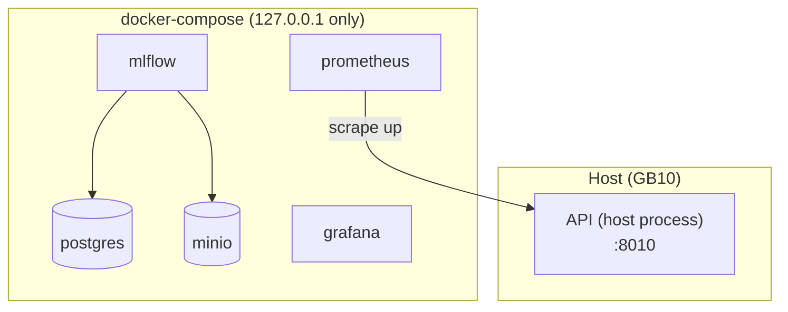

> **Status honesty (OI-9):** the **api and dashboard container images have never
> been built**. `make up` boots the *infrastructure* services (postgres/minio/
> mlflow/prometheus/grafana) while the API runs on the host and is scraped by the
> containerized Prometheus via a dedicated host-scrape target. The image build is
> expected to be slow (large layers) and is deferred to Phase 8 or Azure. So the
> compose stack is **Implemented and tested except the app image builds**.

> **Key takeaways:** a multi-stage, non-root, torch-free app image with a
> healthcheck; a loopback-only compose stack with `cap_drop: ALL` +
> `no-new-privileges` + read-only API; the infra services boot healthy, but the
> app container images have not yet been built (OI-9).

**Repository paths used:** `Dockerfile`, `docker-compose.yml`,
`infrastructure/compose/`, D-035, `docs/open-issues.md` (OI-9),
`docs/test-evidence.md`.

---

## Chapter 31: Testing Strategy

> **What you will learn:** how the test suite is organized, what each category
> proves, and where coverage honestly stops.

### The categories

Tests live under `tests/` split by *kind* (`pyproject.toml`, `testpaths =
["tests"]`, `--strict-markers`):

| Directory | What it proves | Files (this commit) |
|---|---|---|
| `unit/` | isolated logic: config fail-closed, calibration, image quality, recommendations, audit, auth, assistants, AML scoring adapters, … | 23 |
| `ml/` | ML correctness: leakage/splits, generalization regression (D-024), attribution geometry, graph-feature math | 5 |
| `contract/` | golden JSON-Schema additive-only compatibility (`golden/`) | 1 |
| `security/` | middleware order, 401/403-before-model, 413/415/429, safe errors, headers | 1 |
| `end_to_end/` | generate → train → serve → predict → feedback → audit; dashboard smoke | 2 |
| `integration/` | needs running services (postgres/minio/mlflow) | (empty — pending) |
| `performance/` | load / failure injection | (empty — pending) |

Markers gate the environment-dependent tests: `integration` (needs services),
`gpu` (needs CUDA), `slow`. CI runs `-m "not integration and not gpu and not
slow"`.

### The count and what it means

At this commit, **182 tests pass** (`docs/test-evidence.md`), grown phase by
phase: 34 (Phase 1) → 53 → 62 → 104 → 155 → 172 → 182. Each increment traces to
a dated evidence entry. Alongside the tests: ruff clean, mypy clean (76 source
files), bandit reporting only the 4 pre-accepted LOW findings.

### The pyramid, and its honest gaps

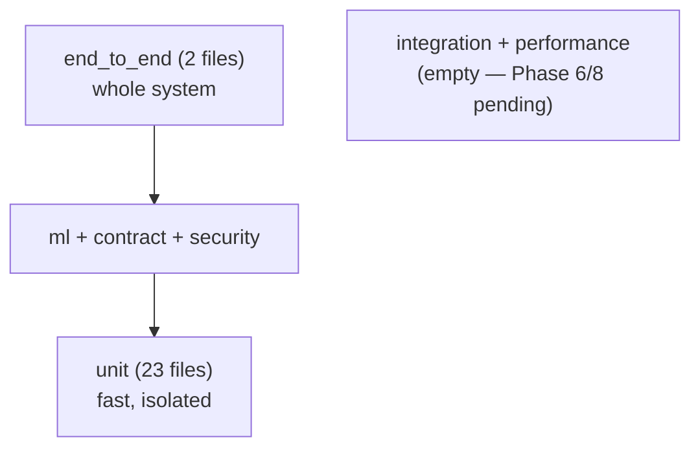

> **Status honesty:** the `integration/` and `performance/` directories exist
> but hold **no tests yet**. `PLAN.md` acceptance criterion 12 records this: the
> unit/ml/contract/security/e2e suites are green, but compose-stack integration
> and performance/load suites **remain** (Phase 6/8). Some parts have been
> *manually* exercised (the compose boot, the live MLflow server) and recorded in
> test evidence, but they are not yet automated tests. This tutorial counts only
> what actually runs.

### The two regression tests worth knowing

Both failure stories from earlier chapters became permanent tests:
`tests/ml/test_generalization.py` (the D-024 leakage — asserts temporal test AUC
tracks the random-CV ceiling and no numeric feature has disjoint train/test
ranges) and `tests/unit/test_image_quality.py` (the D-027 blur threshold — 90%
detection / 15% false-flag).

> **Key takeaways:** tests are organized by kind with environment markers; 182
> pass at this commit with every increment traceable to dated evidence; the unit/
> ml/contract/security/e2e layers are solid; integration and performance suites
> are empty and honestly pending.

**Repository paths used:** `tests/` (tree), `pyproject.toml` (pytest config),
`docs/test-evidence.md`, `PLAN.md`.

---

## Chapter 32: CI/CD

> **What you will learn:** the continuous-integration design, how it reaches
> Azure without a stored secret, and the plain fact that it has never run.

### The pipeline design

`.github/workflows/pr.yml` (Chapter 29) is the pull-request gate: three jobs —
`quality`, `supply-chain`, `container` — triggered on `pull_request` and
`workflow_dispatch`, with `permissions: contents: read`. It embodies the
principle that the same commands developers run through `make` also run in CI, so
there is no drift between local and pipeline checks.

### Identity without secrets (ADR-0014)

The deployment design reaches Azure through **GitHub OIDC workload-identity
federation** — no client secret is ever stored. A run acquires the
`id-fg-<env>-deploy` identity only after the token's subject
(`repo:<owner>/<repo>:environment:<env>`) matches the federated credential, and
that happens only after the GitHub **environment's required reviewers approve**.
The human gate before production is therefore an identity-issuance gate, not just
a UI nicety.

`docs/operations/azure-devops-equivalents.md` maps every property to Azure
DevOps (service connection with workload-identity federation, environment
approvals, Key Vault-linked variable groups, branch policies) so the security
model carries over for organizations not on GitHub.

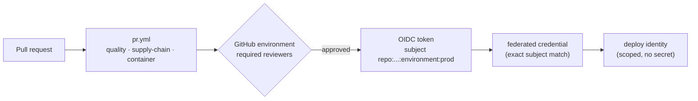

### The plain fact

> **Status honesty (OI-4):** this workflow has **never executed**. No GitHub
> remote existed, so GitHub Actions has never run a single job. The workflow is
> **Defined as configuration**, validated only by local YAML parsing and by
> running the same commands through `make`. Every "passing" claim in this
> tutorial comes from **local** runs recorded in `docs/test-evidence.md`, never
> from CI. Nothing about the OIDC-to-Azure path has run either — it depends on
> both a GitHub remote and an Azure subscription, neither of which this
> environment has. Treat CI/CD as authored-and-unexecuted.

> **Key takeaways:** a three-job PR gate mirroring the local `make` checks; a
> secretless OIDC-federated path to Azure with a human approval gate that
> doubles as the identity-issuance gate; Azure DevOps equivalents documented —
> and the entire workflow authored but never executed (OI-4).

**Repository paths used:** `.github/workflows/pr.yml`, ADR-0014,
`docs/operations/azure-devops-equivalents.md`, `docs/open-issues.md` (OI-4).

---

## Chapter 33: Infrastructure as Code

> **What you will learn:** how the whole Azure environment is expressed as code,
> what "validated" means here, and the plain fact that none of it has run.

> **Read this first — it applies to Chapters 33 through 39:** **this repository
> has never deployed to Azure.** There is no subscription, no credentials, and no
> `az` CLI on the development machine (Phase 0 evidence: `az version` → command
> not found). Everything in these chapters is **Defined as infrastructure or
> configuration** and validated *locally only* — Bicep is **lint/compile
> validated**, nothing more. No `az deployment` has ever run (OI-10). This is
> stated once here and repeated wherever it matters; the tutorial never hedges.

### Bicep — the primary IaC (ADR-0013)

`infrastructure/bicep/` is the landing zone: a subscription-scope entrypoint
plus modules. `main.bicep` (`targetScope = 'subscription'`) creates the spoke
resource group, cost guardrails (budget + alerts), and a `CanNotDelete` lock,
then hands off to `stack.bicep`, which composes **15 modules**:

| Module | Creates |
|---|---|
| `network` | spoke VNet, subnets, NSGs |
| `private-dns` | 9 private DNS zones |
| `private-endpoint` | reusable private-endpoint pattern |
| `identity` | 3 UAMIs + GitHub OIDC federation |
| `rbac` | resource-scoped role assignments |
| `keyvault`, `storage`, `acr` | secrets, ADLS+blob, registry (shared keys off) |
| `postgres` | PostgreSQL 16, Entra-only auth |
| `aml` | workspace, compute clusters, model registry |
| `container-apps` | env + api/dashboard/worker apps |
| `monitoring` | Log Analytics + App Insights |
| `eventhubs` | flag-gated, off by default |
| `budget`, `policy`, `lock` | cost, guardrails, delete lock |

Parameters are per-environment: `environments/{dev,prod}.bicepparam`.

### What "validated" means

The Phase 7 evidence (`docs/test-evidence.md`) is precise: Bicep CLI 0.45.15
ran `bicep build main.bicep` + `bicep build-params` for both param files →
**exit 0, zero errors, zero warnings** — but only *after* fixing 5 initial
warnings (ACR name min-length inference, an `anonymousPullEnabled` API version,
a hardcoded login endpoint → `environment()`, a documented `#disable-next-line
BCP037` for the real-but-untyped `systemDatastoresAuthMode`, and a guarded
conditional-module dereference). That is the entire validation: **schema and
type checks, not service acceptance**. As OI-10 records, "resource properties
are typed-schema-checked, not service-accepted; the first real what-if may
surface API-version or quota nits".

### Terraform — a partial equivalent

`infrastructure/terraform/` is a **partial** landing-zone equivalent (core +
module-map README). It passed `terraform fmt -check`, `terraform init
-backend=false`, and `terraform validate` → "Success! The configuration is
valid." (1.10.5, azurerm ~>4.0) after fixing two provider deprecations. Also
compile-clean, also never applied.

> **Key takeaways:** Bicep is the primary IaC — a subscription-scope main plus
> 15 modules plus per-env param files — and it compiles with zero warnings; a
> partial Terraform equivalent validates too; but validation here means *the
> template compiles*, not *the cloud accepted it* — nothing has ever been
> deployed.

**Repository paths used:** `infrastructure/bicep/**` (main, stack, 15 modules,
`environments/*.bicepparam`, README), `infrastructure/terraform/**`, ADR-0013,
`docs/test-evidence.md`, `docs/open-issues.md` (OI-10).

---

## Chapter 34: Azure Architecture

> **What you will learn:** the target cloud topology — hub-spoke, private
> everything, managed identity everywhere — as designed in code and docs.

*(The Chapter 33 banner applies: this topology is designed and encoded in Bicep,
never deployed.)*

### Hub and spoke

The design (ADR-0009/0010/0011, `docs/architecture/azure-architecture.md`)
places FactoryGuard in an **org-owned hub** (Azure Firewall, Bastion, DNS
resolver — assumption A11) peered to a **spoke** resource group this repo owns.
The spoke holds two compute planes and the data services:

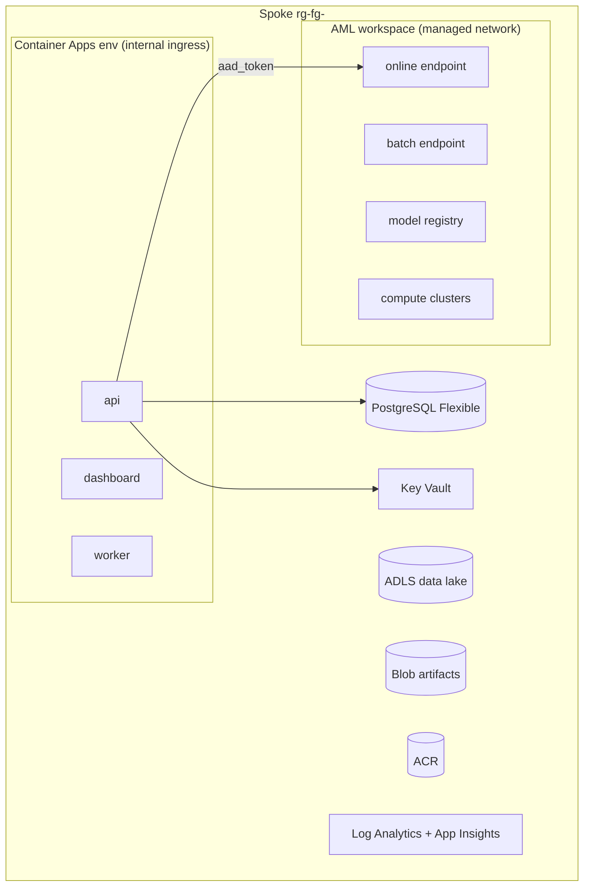

Two roles for two planes: the **application API** (contract, auth, policy
engine, audit) runs in **Container Apps**; **model scoring** runs behind the
**AML managed online endpoint**, called via `RemoteScorer` (ADR-0008). Locally
the identical API uses `InProcessScorer` — one codebase, config-switched, so
local and cloud can never drift.

### Private everything (ADR-0011)

`docs/architecture/network-topology.md`: **zero public endpoints**. Every PaaS
dependency (storage ×2, Key Vault, ACR, AML workspace, PostgreSQL, Event Hubs
when enabled) has `publicNetworkAccess: Disabled` and is reachable only through
a **private endpoint** in `snet-private-endpoints`, backed by **9 private DNS
zones**. The **AML managed network** is Microsoft-managed isolation with
`AllowOnlyApprovedOutbound` and **zero FQDN rules** (D-040) — weights are baked
into environment images at build time, never fetched at run time.

### Data flow across the boundary

`docs/architecture/data-flow.md` describes training (datasets in ADLS → AML
clusters → checksummed bundles in Blob + AML registry) and inference (Container
Apps API → aad_token → AML online endpoint → response + audit), with the same
trust boundaries as the local design (Chapter 3): untrusted callers/payloads,
semi-trusted scorer and assistant output, trusted code/artifacts/config.

> **Key takeaways:** hub-spoke with an org-owned hub; application in Container
> Apps, scoring in AML, all data services private-endpoint-only behind 9 DNS
> zones; the AML managed network runs approved-outbound-only with no FQDN rules;
> the same API code serves locally and in-cloud via a config-switched scorer —
> all designed and encoded, none deployed.

**Repository paths used:** `docs/architecture/{azure-architecture,network-topology,data-flow,security-architecture}.md`,
`infrastructure/bicep/modules/{network,private-dns,private-endpoint,aml,container-apps}.bicep`,
ADR-0009/0010/0011.

---

## Chapter 35: Azure Machine Learning Workflow

> **What you will learn:** how training and scoring move to Azure ML without
> changing the model code, and which single piece of this is actually tested.

*(The Chapter 33 banner applies: AML assets are YAML/code, validated by parsing
and unit tests, never run against a workspace.)*

### The cloud twin of the local pipeline

`deployment/azureml/` mirrors the local workflow one-to-one. The training job
(`jobs/train-multimodal.yaml`) is the **cloud twin of `make train-multimodal`**:
it invokes the unchanged `pipelines/training/train_multimodal.py`, mapping the
CLI's `--data-root`/`--artifacts-root`/`--reports-root` onto mounted AML
inputs/outputs. MLflow tracking goes to the workspace automatically; lineage
tags (git commit, dataset manifest SHA-256, seed) are set by the pipeline
itself. It runs under a `managed_identity` (the training UAMI), reads datasets
from an **identity-based datastore** (`datastores/datalake-curated.yaml`), and
uses prebuilt ACR environment images (`environments/{train,serve}-env.yaml`).

### Scoring adapters — the one tested part

Two endpoints are defined: a **managed online endpoint** (`aad_token` auth,
private) with a blue deployment, and a **batch endpoint** with a JSONL
deployment. Their scoring entries — `scoring/score.py` and
`scoring/score_batch.py` — are **thin adapters** over the tested
`PredictionService`:

```mermaid
flowchart LR
    REQ[scoring request] --> INIT["init(): locate manifest bundle\n→ ArtifactBundle.load (checksum-verified)"]
    INIT --> SVC[PredictionService]
    SVC --> RUN["run(): same calibrated fusion →\nconformal/OOD → root cause → recommendations"]
    RUN --> RESP[response]
```

`init()` locates the single checksum-manifested bundle under
`AZUREML_MODEL_DIR`, loads it (checksums honored via `FG_VERIFY_CHECKSUMS`), and
builds the service; `run()` delegates to the same code the local API uses — "so
local and cloud scoring cannot drift apart".

> **What is actually tested:** `tests/unit/test_azureml_scoring.py` — **5 unit
> tests** (bundle discovery, fail-loud without a manifest, run-before-init
> guard, init/run plumbing incl. `FG_SERVING_MODE` + checksum flag, batch JSONL
> scoring), all green (`docs/test-evidence.md`). These run against a **local
> artifact bundle** — no AML workspace involved. Everything else (the job, the
> endpoints, the datastore) is YAML that only `yaml.safe_load` has validated, and
> the deployment itself is unexecuted (OI-10).

> **Key takeaways:** the AML training job reuses the exact local pipeline CLI;
> the online/batch scoring entries are thin adapters over the shared
> `PredictionService`, so cloud scoring is the same code as local; the adapters
> have 5 passing unit tests against a local bundle, but no AML asset has ever
> been created.

**Repository paths used:** `deployment/azureml/**` (jobs, endpoints, datastores,
environments, `scoring/score{,_batch}.py`), `tests/unit/test_azureml_scoring.py`,
`docs/operations/azure-deployment-runbook.md`, ADR-0008.

---

## Chapter 36: Microsoft Foundry in FactoryGuard

> **What you will learn:** the two roles Microsoft Foundry plays, how the
> optional Claude Fable 5 summarizer is fenced, and why it is dormant.

*(The Chapter 33 banner applies: Foundry is a documented integration; the
summarizer's failure modes are tested, but it has never called a real endpoint.)*

### Two roles (ADR-0015)

`docs/operations/foundry-integration.md` describes two uses:

1. **AI governance surface** — a Foundry project gives the org one place to
   govern hosted-model access (catalog allow-listing, quota, content-filter
   policy, usage audit) alongside the AML workspace.
2. **Optional Claude Fable 5 summarizer** — the cloud counterpart of the local
   SLM assistant (`FoundrySummarizer` in
   `src/factoryguard/assistants/summarizer.py`), producing the advisory summary
   attached to prediction responses.

**Nothing depends on Foundry.** The deterministic `TemplateSummarizer` is the
default and permanent fallback; assistant output is contractually advisory. If
Foundry is never provisioned, everything works.

### The fences (repeated from Chapter 21, enforced in code)

The same three hard constraints apply, and they are what make an LLM safe to sit
near this system:

- **Structured evidence only** — `FoundrySummarizer._evidence` serializes an
  enumerated allow-list of response fields; there is **no caller-text path** into
  the prompt, so prompt injection is removed by construction.
- **Validated output with deterministic fallback** — every generation passes
  `validate_assistant_output`; any violation, SDK absence, missing credential,
  network failure, refusal, or truncation serves the template (D-041).
- **Advisory only** — nothing parses assistant text back into decisions.

### Wiring, and why it is dormant

Enabling it (per the runbook) means: provision a Foundry project, enable the
Anthropic model family, put the key in Key Vault (`foundry-api-key` →
`FG_FOUNDRY_API_KEY`), set `assistant.provider: foundry`, and **add the pinned
`anthropic` SDK to `requirements/lock.txt`**.

> **Status honesty (OI-11):** the `anthropic` SDK is **intentionally not pinned**
> today. `FoundrySummarizer` lazy-imports it and falls back to the template when
> absent. It is **Implemented and tested at the fallback/validation level** — 5
> unit tests in `tests/unit/test_assistant.py` (SDK-absent fallback,
> invalid-output fallback, valid-output pass-through, structured-evidence
> allow-list, builder wiring) — but has **never executed against a real Foundry
> endpoint**. It is wired, tested for its failure modes, and dormant.

> **Key takeaways:** Foundry is an optional governance surface plus an optional
> Fable 5 summarizer; the summarizer inherits Chapter 21's five fences; it is
> dormant because the SDK is deliberately unpinned, and only its
> fallback/validation behavior is tested — no real call has happened.

**Repository paths used:** `docs/operations/foundry-integration.md`,
`src/factoryguard/assistants/summarizer.py` (`FoundrySummarizer`),
`tests/unit/test_assistant.py`, ADR-0015, `docs/open-issues.md` (OI-11).

---

## Chapter 37: Azure Container Apps Runtime

> **What you will learn:** how the application tier runs in Azure Container Apps,
> its ingress and identity posture, and why AKS was rejected.

*(The Chapter 33 banner applies: this is Bicep, compile-validated, never
deployed.)*

### Why Container Apps, not AKS (ADR-0009)

The decision was **AML + Container Apps, no AKS**: the application tier is a few
stateless web/worker apps that do not justify operating a Kubernetes cluster;
model scoring belongs in AML (Chapter 35). Container Apps gives VNet
integration, managed identity, revisions, and scale-to-N without cluster
operations.

### The three apps

`infrastructure/bicep/modules/container-apps.bicep` defines a VNet-integrated
**internal-ingress** environment (`internal: true`) and three apps:

| App | Ingress | Scale | Identity |
|---|---|---|---|
| api | internal only (`external: false`) | `apiMinReplicas`..`apiMaxReplicas` (default 1–5) with scale rules | runtime UAMI |
| dashboard | internal only | 1–2 | runtime UAMI |
| worker | **no ingress** (`port: 0`, outbound-only) | 1–1 | runtime UAMI |

Design details from the module:

- **No public ingress anywhere** — the environment is internal; governed
  external exposure (APIM/App Gateway with mTLS) is an org concern in the hub.
- **Image pull by identity**: `registries: [{ server: acrLoginServer, identity:
  runtimeIdentityId }]` — the runtime UAMI pulls from ACR with `AcrPull`; no
  registry password exists.
- **Config via `FG_*` env vars** read by the fail-closed settings loader
  (Chapter 6) — e.g. `FG_AUTH__ISSUER` is built from `az.environment()` and the
  tenant ID; secrets come from Key Vault references, never inline.
- The **worker** is the drift/monitoring runner (Chapter 27) — outbound-only,
  single replica, no ingress surface at all.

```mermaid
flowchart LR
    ACR[(ACR)] -->|AcrPull via UAMI| CAE["Container Apps env\ninternal ingress"]
    subgraph CAE
        API[api 1–5] ; DASH[dashboard 1–2] ; WRK[worker outbound-only]
    end
    KV[Key Vault] -->|secret refs| API
    API -->|aad_token| AML[AML online endpoint]
```

> **Status honesty:** every property above is typed-schema-checked by `bicep
> build` (0 warnings) and **not one Container App has ever been created**. The
> app container images themselves have never been built either (OI-9), so even a
> real deployment would need the image build first.

> **Key takeaways:** Container Apps (not AKS) runs three internal-ingress apps —
> api, dashboard, and an outbound-only worker — pulling images by managed
> identity and configured through `FG_*` env vars and Key Vault references;
> designed and compile-validated, never deployed, images never built.

**Repository paths used:** `infrastructure/bicep/modules/container-apps.bicep`,
ADR-0009, `docs/open-issues.md` (OI-9).

---

## Chapter 38: Azure Security Walkthrough

> **What you will learn:** the identity-to-resource access model, the port
> matrix, and — again, plainly — the security docs that do not exist.

*(The Chapter 33 banner applies: identities and RBAC are encoded in Bicep,
compile-validated, never deployed.)*

### No shared credentials, resource-scoped RBAC

`docs/architecture/security-architecture.md` states the posture: **no service
principal with a client secret exists anywhere in the design**. Every identity
is a UAMI or system-assigned MSI (`identity.bicep`), and every RBAC assignment
(`rbac.bicep`) is **scoped to the individual resource, never the subscription**.
The identity→resource matrix in the doc *mirrors* `rbac.bicep` — they are meant
to change together. A sample of the model:

| Identity | Resource | Role |
|---|---|---|
| runtime UAMI | ACR / Key Vault / Blob / ADLS | AcrPull / Secrets User / Blob Contributor / Blob Reader |
| training UAMI | ADLS / Blob / ACR | Blob Contributor / Blob Contributor / AcrPull |
| deploy UAMI (GitHub OIDC) | ACR / AML workspace / RG | AcrPush / AzureML Data Scientist / Reader |

CI reaches Azure **only** through OIDC workload-identity federation with the
subject pinned to `repo:<owner>/<repo>:environment:<env>` (Chapter 32). The
broad grant needed to run `az deployment sub create` is deliberately **not**
baked into `rbac.bicep` — it is applied by a subscription owner at pipeline
setup and documented in the runbook, keeping the elevated path a conscious,
auditable step.

### The port matrix

`docs/architecture/network-topology.md` carries a port/protocol matrix (14 rows
+ documented exceptions): every PaaS dependency is `publicNetworkAccess:
Disabled`, reached only via private endpoints in `snet-private-endpoints`, with
the Container Apps subnet delegated to `Microsoft.App` and private-endpoint
network policies on. The AML managed network is `AllowOnlyApprovedOutbound` with
zero FQDN rules (D-040).

### The gaps, stated plainly

> **Status honesty (Phase 8 gap):** as in Chapter 28, `docs/security/` is
> **empty** — there is **no threat model document**, even though `SECURITY.md`
> points to it. `docs/responsible-ai/` is **empty** — no standing responsible-AI
> document set (only per-dataset cards and an MLflow model card artifact exist).
> `PLAN.md` acceptance criterion 22 is **pending**. The identity and network
> *design* is thorough and encoded; the security *documentation set* is not
> written.

> **Key takeaways:** the Azure security model is zero-trust — no shared
> credentials, resource-scoped RBAC mirroring the Bicep, OIDC-only CI, private
> endpoints for everything, approved-outbound-only AML — all compile-validated
> and unexecuted; and the threat-model and responsible-AI docs remain empty
> Phase 8 gaps.

**Repository paths used:** `docs/architecture/security-architecture.md`,
`docs/architecture/network-topology.md`,
`infrastructure/bicep/modules/{identity,rbac}.bicep`, `docs/security/` (empty),
`docs/responsible-ai/` (empty), `PLAN.md`.

---

## Chapter 39: Deployment and Rollback

> **What you will learn:** the ordered deployment procedure, the canary and
> rollback design, and the guards that stop an accidental deploy.

*(The Chapter 33 banner applies: the scripts are syntax-checked and the runbook
is authored; nothing has run.)*

### The driver scripts and their guards

`scripts/azure/deploy.sh <env> plan|apply` wraps the runbook procedure. It
refuses to proceed unless several guards pass: **no unresolved `<placeholders>`**
in the param file, an **authenticated `az` session** against the intended
subscription, and a **clean `bicep build`**. `plan` runs what-if only (safe);
`apply` runs what-if, confirms, then deploys. `scripts/azure/teardown.sh`
requires interactive confirmation and **refuses prod**. Both passed `bash -n`
syntax checks (shellcheck was unavailable on the machine).

### The ordered procedure

`docs/operations/azure-deployment-runbook.md` lays out ten sections:

```mermaid
flowchart LR
    A["1–2 auth + one-time grants"] --> B["3 fill params"] --> C["4 what-if → deploy infra"]
    C --> D["5 publish images"] --> E["6 data + AML assets + training"]
    E --> F["7 register → endpoints → canary"] --> G["8 rollback"] --> H["9 teardown"] --> I["10 cost"]
```

### Canary and rollback

Promotion to a live endpoint is **blue/green with gate checks**: registry
promotion (CANDIDATE→VALIDATED→STAGING) runs with the human approval gate
(ADR-0017 — no promotion without an approver), then traffic shifts gate check →
50/50 → gate check → 0/100, deleting blue only after soak. Gate checks (App
Insights + drift suite) verify P95 latency, error rate < 1%, abstention within
±5pp, and no calibration drift — any breach triggers rollback. This is the
operational half of demonstration Scenario G.

Rollback is layered and fast where it can be:

| Layer | Action | Time |
|---|---|---|
| Model (canary) | shift endpoint traffic back to blue=100 | seconds |
| Model (post-promotion) | demote champion → previous VALIDATED, redeploy | minutes |
| Application | activate a prior Container Apps revision | seconds–minutes |
| Infrastructure | redeploy last known-good Bicep git tag (incremental) | minutes |
| Data | PostgreSQL PITR + storage soft delete | minutes–hours |

Every rollback writes an audit entry with the approver identity — the same
requirement as promotion.

> **Documentation-vs-code note:** the runbook references a
> `pipelines/registration` rollback path, but there is **no such pipeline
> directory** — registry promotion/demotion logic actually lives in
> `src/factoryguard/mlops/registry.py` (Chapter 25). The *mechanism* exists and
> is tested locally; the runbook's path name is aspirational shorthand for it.

> **Key takeaways:** guarded deploy/teardown scripts (placeholder/auth/build
> guards, prod-refusing teardown); a ten-step runbook; blue/green canary gated on
> latency/error/abstention/drift with layered, audited rollback — all authored
> and syntax-checked, none executed against a cloud.

**Repository paths used:** `scripts/azure/{deploy,teardown}.sh`,
`docs/operations/azure-deployment-runbook.md`,
`docs/operations/retraining-runbook.md`, `src/factoryguard/mlops/registry.py`,
`Makefile`.

---

## Chapter 40: Demonstration Scenarios

> **What you will learn:** the ten scenarios the system is designed to
> demonstrate (spec §28), what evidence backs each, and which one is not built.

Each scenario stresses a specific capability. The status column is honest —
several are proven by tests, one is not implemented.

| # | Scenario | Capability | Status / evidence |
|---|---|---|---|
| A | tool wear raises risk, **tool ranked as cause** | root-cause ranking | **Implemented and tested** — root-cause hit@3/hit@5 vs ground truth (Ch 19) |
| B | bad supplier lot **linked across lines** via graph | cross-line graph signal | **Implemented and tested** — supplier-lot risk feature (Ch 14) |
| C | camera misalignment detected as **image-quality drift, not defect** | quality vs defect separation | **Implemented and tested** — D-027 blur scorer, 90% detection (Ch 13) |
| D | new revision → **OOD + higher abstention** | OOD + abstention | **Implemented and tested** — Mahalanobis OOD + policy (Ch 17) |
| E | missing sensor → **fusion degrades gracefully, flags modality, lowers confidence** | trained missingness | **Implemented and tested** — modality dropout + mask (Ch 15) |
| F | malformed/poisoned payload **rejected/quarantined** | input validation + hardening | **Implemented and tested** — validator corruption tests (Ch 8) + security middleware (Ch 22) |
| G | candidate with better aggregate accuracy but **worse critical-defect recall fails promotion** | gated promotion | **Implemented and tested** — real weak candidate rejected (Ch 18, 25) |
| H | shared machine/tool/lot ranked with graph evidence, **no causal overclaim** | association not causation | **Implemented and tested** — root cause + language discipline (Ch 14, 19) |
| I | **cold start**: useful anomaly-only predictions with zero labels | serving modes | **Implemented** — anomaly-only mode works; **honest finding OI-7**: combined cold-start score ≈ chance under drift, image-distance the only strong component (Ch 16) |
| J | abstained image **triaged by the local VLM assistant** (advisory-marked) | VLM triage | **Documented design only** — **not implemented**, an ADR-0020 sketch (Ch 21) |

### The two most instructive

**Scenario G** is the governance flagship: aggregate accuracy can improve while
recall on a rare critical severity collapses. The promotion gates
(`configs/policies/promotion.yaml`) plus the champion comparison catch exactly
this, and Phase 6 recorded a real rejection (tiny candidate ROC 0.389 < 0.52
floor). The gate is not decorative.

**Scenario I** is where the tutorial's honesty discipline shows: cold start
*runs* and is *useful for ranking*, but the combined equal-weight anomaly score
is ≈ chance on the drifted test periods because the statistical-TS and
graph-prior components degrade under drift (OI-7). Image-distance (ROC 0.81) is
the one strong component, but it only covers units with images. The
config-gated drift-aware weighting (Chapter 16) is the documented fix, disabled
by default.

> **Key takeaways:** eight of the ten scenarios are implemented and tested; cold
> start (I) runs but with an openly documented weakness; VLM triage (J) is a
> design sketch that is not built — the tutorial says so rather than pretending.

**Repository paths used:** `docs/specification/factoryguard-spec-v2.md` (§28),
`configs/data/*.yaml`, `tests/ml/`, `tests/unit/test_image_quality.py`,
`docs/open-issues.md` (OI-7), ADR-0020.

---

## Chapter 41: Troubleshooting

> **What you will learn:** the failure modes a new user actually hits, and the
> one command that diagnoses most of them.

### Start with the doctor

`make doctor` (`scripts/doctor.py`) checks Python, dependencies, GPU matmul, and
directories — run it first when anything misbehaves (**Verified locally**). On a
GPU machine it ends with `NVIDIA GB10; matmul ok; torch cuda 13.0`; on a
CPU-only machine it reports the CPU state, and the `tiny` profile plus tabular
baselines still work.

### Common problems and their real causes

| Symptom | Cause | Fix |
|---|---|---|
| torch installs but no CUDA | installed from PyPI's default index | reinstall from `requirements/torch.txt`'s pinned cu130 index; `make setup` does this |
| torch warns "capability 12.1 vs supported 12.0" | GB10 reports a newer capability than this build lists | **cosmetic** — kernels run via PTX forward compat (OI-1, resolved) |
| TabPFN challenger "unavailable" | `TABPFN_TOKEN` not set (license) | expected here (OI-5); set the token after accepting the license, or ignore — HGB primary is unaffected |
| API returns **503** on predict | no model bundle loaded | train first (`make train-multimodal`), or point at a registered champion; the 503 (not 500) is intentional (Ch 22) |
| POST returns 401/403 | missing/insufficient token | issue a dev token (`scripts/issue_dev_token.py`); check the role's scopes (Ch 23) |
| compose: postgres won't boot | `cap_drop: ALL` blocks root→postgres drop | already fixed via `user: postgres` (D-035) — pull the current compose file |
| Prometheus can't scrape :8000 | port occupied by an unrelated dev-box service | host scrape target is 8010 (`docs/test-evidence.md`) |
| any `az ...` command fails | no Azure CLI/credentials on this machine | by design (Phase 0); all Azure work is unexecuted (OI-10) |
| dashboard KeyError on `shift` | `row.shift` collides with pandas `.shift()` | use `row["shift"]` — fixed in Phase 5 |

### The open-issues register is the source of truth

`docs/open-issues.md` (OI-1..OI-11) records every known limitation with impact
and next action — resolved ones (OI-1, OI-2, OI-R1, OI-10, OI-11 entries) are
kept for the audit trail. When a behavior looks wrong, check there before
assuming a bug: several "problems" are documented, deliberate states (cold-start
weakness OI-7, in-memory serving state OI-8, unbuilt app image OI-9).

> **Key takeaways:** `make doctor` diagnoses most environment issues; the
> frequent surprises (wrong torch index, cosmetic capability warning, TabPFN
> license, 503 without a model, missing `az`) all have documented causes; the
> open-issues register distinguishes real bugs from deliberate states.

**Repository paths used:** `scripts/doctor.py`, `docs/test-evidence.md`,
`docs/open-issues.md` (OI-1..OI-11), `docs/decision-log.md` (D-035).

---

## Chapter 42: Safe Extension Guide

> **What you will learn:** how to change this system without breaking its
> guarantees — because the guarantees are enforced by tests, not etiquette.

The recurring pattern: **the thing you want to change is guarded, so change it
where the guard expects.**

### Add an API field

The contract (`src/factoryguard/contracts/v1.py`) evolves **additive-only** —
golden JSON Schemas in `tests/contract/golden/` make removing or retyping a field
a test failure. To add a field: add it as **optional with a default** to the
Pydantic model, regenerate the golden schema, and the compat test confirms the
change is additive. Anything else is rejected by CI (well — by the local test
run; CI itself is unexecuted, Chapter 32).

### Add a recommendation action or policy

The action allow-list (`ACTION_TAXONOMY`, `recommendations/engine.py`) is
closed. A new action must be **added to the taxonomy** first — otherwise the
engine *and* the assistant validator reject it (Chapter 20). Add the policy with
an ID (POL-009…), decide whether it is approval-gated, and add a test. Never let
a policy emit a string not in the taxonomy.

### Add a config setting

Add the field with a **secure default** to the right `*Config` class; if a
permissive value would be dangerous in production, extend `_fail_closed` and add
a test proving startup dies (Chapter 6). Override per environment in
`configs/environments/*.yaml`. Thresholds (drift, promotion) belong in
`configs/policies/*.yaml`, not code.

### Add a model or a mechanism

A new model implements the shared `ProbabilisticClassifier` / `AnomalyScorer`
Protocol (`models/interfaces.py`) so fusion and evaluation treat it uniformly;
persist it as joblib + SHA-256 manifest + lineage (Chapter 11). A new synthetic
defect mechanism goes in `data/mechanisms.py` and **must record entity
attribution** so it becomes root-cause ground truth (Chapter 7).

```mermaid
flowchart LR
    CHANGE[Proposed change] --> WHERE{Guarded by?}
    WHERE -->|contract| GOLD[additive-only + golden schema]
    WHERE -->|action| TAX[taxonomy allow-list]
    WHERE -->|config| FC[secure default + fail-closed test]
    WHERE -->|model| PROTO[Protocol + checksum + lineage]
    WHERE -->|mechanism| GT[entity-attributed ground truth]
```

> **The cardinal rule:** never read `ground_truth/` from features or models
> (Chapter 7). `grep -rn "ground_truth" src/factoryguard/features/
> src/factoryguard/models/` must stay at zero hits — it is the integrity line of
> the whole project.

> **Key takeaways:** every extension point has a guard — additive-only contracts,
> a closed action taxonomy, fail-closed config, Protocol+checksum models,
> entity-attributed mechanisms; extend at the guard and the tests keep the
> guarantees intact; never leak ground truth.

**Repository paths used:** `src/factoryguard/contracts/v1.py`,
`tests/contract/`, `src/factoryguard/recommendations/engine.py`,
`src/factoryguard/config/settings.py`, `src/factoryguard/models/interfaces.py`,
`configs/`.

---

## Chapter 43: Learning Exercises

> **What you will learn:** a graded set of hands-on exercises, each labeled by
> what it needs — most run on CPU with just the repo. Answers are in
> Appendix I.

Every exercise carries the tutorial's command labels (see *How to use this
tutorial*). None create billable resources — the Azure exercises are
planning/validation only.

### Beginner (Python + repo, CPU is enough — `tiny` profile)

1. **Environment check** *(Planning/validation only)*: run `make doctor` and read
   its output; identify whether you have a GPU and which torch build is installed.
2. **Generate and inspect** *(Verified pattern)*: `make generate-data
   PROFILE=tiny`, then open `data/tiny/tables/units.parquet` in pandas and find
   the Chapter 9 feature columns (`tool_age_cycles`, `crimp_height_mm`, …).
3. **Determinism** *(Verified pattern)*: generate the same profile twice into
   different data roots with the same seed; `diff` the two `manifest.json` files
   — they must be identical (Chapter 7).
4. **Ground-truth separation** *(safe)*: `grep -rn "ground_truth"
   src/factoryguard/features/ src/factoryguard/models/` — confirm zero hits
   (Chapter 42).
5. **Validate corruption** *(safe, reversible)*: copy `data/tiny/`, break one
   foreign key, run `make validate-data`, observe the quarantine + report; delete
   the copy (Chapter 8).

### Intermediate (`make` targets, sometimes the Docker stack)

6. **Train and read a report** *(Expected but not rerun)*: `make train-multimodal
   PROFILE=small`; open `reports/evaluation/small/multimodal-report.md` and locate
   calibration ECE before/after and the fusion ROC-AUC.
7. **Serve and predict** *(Requires model bundle)*: `make serve`, issue a dev
   token (`scripts/issue_dev_token.py`), POST a unit to `/api/v1/predictions`, and
   read the serving mode, uncertainty, and root causes in the response.
8. **RBAC** *(Requires model bundle)*: issue a `plant-viewer` token and confirm a
   403 on the approval endpoint; issue a `quality-engineer` token and confirm the
   approval succeeds (Chapter 23).
9. **Drift** *(Requires stack)*: run the drift report with `--simulate-drift` and
   find the injected major-drift features; confirm `terminal_lot_id`'s high PSI is
   excluded from the breach rule (Chapter 27).
10. **IaC lint** *(Planning/validation only; needs the Bicep CLI)*: run `bicep
    build infrastructure/bicep/main.bicep` and confirm zero warnings (Chapter 33).

### GPU-flagged (needs CUDA)

11. **Vision embedding** *(Requires GPU)*: train the multimodal pipeline on
    `medium` and compare DINOv2 image throughput to the benchmark's 1,566 img/s
    (Chapter 13).
12. **Benchmark** *(Requires GPU)*: run `make test-performance` and compare your
    P50/P95/P99 prediction latency to the recorded 43/56/57 ms (Chapter 18).

> **Key takeaways:** the beginner track needs only Python and the repo; the
> intermediate track exercises training, serving, RBAC, drift, and IaC lint; GPU
> exercises reproduce the vision and latency benchmarks — and worked answers are
> in Appendix I.

**Repository paths used:** `Makefile`, `pipelines/`, `data/` (generated layout),
`scripts/issue_dev_token.py`, `reports/evaluation/`.

---

## Chapter 44: Frequently Asked Questions

> **What you will learn:** direct answers to the questions this project's design
> most often raises — each traced to an ADR, open issue, or decision.

**Does FactoryGuard ever control machinery?** No. It is advisory by
construction: allow-listed actions, human approval for high-impact ones, and
`advisory: Literal[True]` on assistant text (Chapters 1, 20, 21).

**Is any of this trained on real factory data?** No. Everything runs on
synthetic data generated from the world model, with causal ground truth kept
physically separate (Chapters 2, 7).

**Why not a single big model, or an LLM, as the scorer?** ADR-0018/D-017: a
Vision-Language Model as the *primary* scorer gives no calibrated probabilities,
second-scale latency, and weaker auditability. Frozen DINOv2 + small trained
heads is calibratable, fast, and auditable (Chapter 13).

**Why NetworkX instead of a Graph Neural Network?** ADR-0007: at thousands of
nodes the work is edge resolution and aggregation, which NetworkX does simply and
portably on ARM64. A GNN is a documented option with revisit triggers (Chapter
14).

**Has anything been deployed to Azure?** No — never. No subscription,
credentials, or `az` CLI exist on the development machine. Bicep is compile-
validated only; the first real `what-if` is pending a subscription (OI-10,
Chapters 33–39).

**Has the CI pipeline ever run?** No. `.github/workflows/pr.yml` is authored and
locally validated but never executed on GitHub (OI-4, Chapter 32). All "passing"
claims come from local runs in `docs/test-evidence.md`.

**Why is the anomaly-only cold-start score weak?** Honest finding OI-7: under
sensor drift the statistical-TS and graph-prior components degrade;
image-distance is the only strong component but covers only units with images.
The drift-aware weighting fix is config-gated and off by default (Chapter 16).

**Is the TabPFN challenger usable here?** Not in this environment — it needs a
free `TABPFN_TOKEN` license not available here (OI-5). It reports itself
unavailable; the HGB primary is unaffected (Chapter 11).

**Where is the threat model / responsible-AI documentation?** Not written yet —
`docs/security/` and `docs/responsible-ai/` are **empty**. They are Phase 8 work
(`PLAN.md`, criterion 22). Dataset cards and a generated model card do exist
(Chapters 28, 38).

**Is the Foundry/Claude summarizer active?** No. The `anthropic` SDK is
deliberately unpinned (OI-11); `FoundrySummarizer` falls back to the
deterministic template, and only its fallback/validation behavior is tested
(Chapters 21, 36).

**What state does the API lose on restart?** The in-memory prediction index,
idempotency cache, and rate-limit windows (OI-8) — PostgreSQL is not yet wired
in; the JSONL prediction log survives (Chapter 22).

**Why did temporal-split ROC-AUC once collapse to chance?** The D-024 leakage:
unrotated tools and non-resetting counters made wear features monotonic proxies
for calendar time. Fixed with tool rotation + counter resets + a permanent
regression test (Chapters 9, 10).

> **Key takeaways:** the answers cluster around three themes — the advisory
> boundary, the synthetic-and-separated data, and the honest unexecuted/empty
> states (Azure, CI, security docs, Foundry) — each traceable to a specific ADR
> or open issue.

**Repository paths used:** `docs/adr/ADR-0001..0021`, `docs/open-issues.md`,
`docs/decision-log.md`, `PLAN.md`.

---

## Chapter 45: Current Project Status

> **What you will learn:** exactly what is done, what is not, and where the
> project stands against its own acceptance criteria — without spin.

### Phases

Nine phase commits, Phase 0 through Phase 7, are complete
(`789ff51`…`700f5ad`). **Phase 8 (hardening + final report) has not started.**

| Phase | Scope | State |
|---|---|---|
| 0 | Discovery, plans, skeleton | ✅ complete |
| 1 | Foundation: locks, config, logging, containers, CI, security tooling | ✅ complete |
| 2 | Synthetic data system | ✅ complete |
| 3 | Baselines + evaluation | ✅ complete |
| 4 | Multimodal fusion, calibration, uncertainty, root cause, retrieval | ✅ complete |
| 5 | Application: API, security, recommendations, assistants, dashboard | ✅ complete |
| 6 | MLOps + observability + benchmark | ✅ complete |
| 7 | Azure design + IaC + AML/Foundry (unexecuted by design) | ✅ authored |
| 8 | Hardening, scans, SBOM, RAI docs, FINAL-REPORT | ⬜ **not started** |

### Test state

**182 tests pass** at this commit (unit/ml/contract/security/e2e); ruff and mypy
clean (76 source files); bandit reports only the 4 pre-accepted LOW findings. The
compose infra stack boots healthy; the MLflow server and Prometheus scrape are
live-verified; the registry champion serves via the API
(`docs/test-evidence.md`).

### What is honestly not done

> **Phase 8 gaps, stated plainly:**
> - `docs/security/` is **empty** — **no threat model** (SECURITY.md even points
>   to it).
> - `docs/responsible-ai/` is **empty** — **no standing RAI document set** (only
>   per-dataset cards and a generated model card exist).
> - **`FINAL-REPORT.md` does not exist.**
> - Integration and performance **test suites are empty** (Chapter 31).
> - **CI has never executed** (OI-4); **Azure has never been deployed** (OI-10).
> - App/dashboard **container images never built** (OI-9); PostgreSQL **not wired
>   into the API** (OI-8); `anthropic` SDK **unpinned** (OI-11).

### Acceptance criteria (spec §31, `PLAN.md`)

Of the 25 criteria, the tracker records roughly half **done** (models train,
leakage-safe evaluation, contract, missing modalities, calibration/abstention,
root cause, explanations, MLflow, checksums/lineage, IaC plannable, private
networking, rollout/rollback design, monitoring/drift, unexecuted-cloud-ops
identified) and the rest **pending** — notably the quick-start verification,
scans+SBOM integrated, secure-prod-config verification, non-privileged
containers, threat model + RAI docs, no-unexplained-TODOs, and the final report.
The pending set is essentially Phase 8.

> **Key takeaways:** Phases 0–7 are complete and 182 tests pass, but Phase 8 is
> untouched — no threat model, no RAI docs, no final report, empty integration/
> performance suites, and the unexecuted CI/Azure/container/DB states carried as
> open issues. The project is a thoroughly-built, honestly-incomplete reference
> implementation.

**Repository paths used:** `PLAN.md` (acceptance tracker),
`docs/implementation-status.md`, `docs/open-issues.md`, `docs/test-evidence.md`,
`docs/security/` (empty), `docs/responsible-ai/` (empty).

---

## Chapter 46: Suggested Learning Path

> **What you will learn:** role-based reading tracks so you can reach the parts
> that matter to you fastest.

The chapters are ordered to build on each other, but you need not read linearly.
Pick a track:

```mermaid
flowchart TB
    START([Pick your role]) --> NEW[New to the project]
    START --> ML[ML engineer]
    START --> APP[Application / backend]
    START --> SEC[Security / platform]
    START --> CLOUD[Cloud / infra]
```

| Track | Read | Then |
|---|---|---|
| **Newcomer** | 1 → 2 → 3 → 5, then Appendix A (Quick Start) | the four "start reading here" files (Ch 5) |
| **ML engineer** | 7 → 9 → 10 → 11–17 → 18 → 19 | 25 (registry), 27 (drift), 40 (scenarios) |
| **Application / backend** | 6 → 8 → 22 → 23 → 24 → 20 → 21 | 26 (observability), 31 (testing) |
| **Security / platform** | 6 → 22 → 23 → 28 → 29 → 30 → 38 | Appendix F (control matrix), 45 (status) |
| **Cloud / infra** | 3 → 33 → 34 → 35 → 37 → 38 → 39 | 32 (CI/CD), Appendix G (resource matrix) |
| **Operator** | 1 → 16 → 17 → 24 → 27 → 41 | Appendix B (commands) |

Conceptual chapters (1–3, 10, 16–21, 28, 34, 36–38) can be read without a
machine; hands-on chapters (4–9, 11–15, 22–27, 30–33, 39–43) reward following
along. Every Azure chapter (33–39) is planning-only in this environment.

> **A note on order for total beginners:** do not skip Chapters 9 and 10 — the
> leakage story (D-024) and the ML vocabulary anchor almost everything later.
> Then jump to Appendix A and actually run the `tiny` profile; nothing cements
> the mental model like watching the pipeline produce a prediction.

> **Key takeaways:** six role tracks route you through the 48 chapters and 12
> appendices; conceptual and hands-on chapters are labeled; beginners should not
> skip the leakage and ML-fundamentals chapters before running the quick start.

**Repository paths used:** this tutorial's chapter structure (internal
cross-references).

---

## Chapter 47: Glossary

> **What you will learn:** concise definitions of the terms used throughout,
> each anchored to where it appears in this project.

**Abstention** — the policy's refusal to answer confidently (ambiguous conformal
set, OOD, or failed data quality), routing to human review (Ch 17).

**Advisory boundary** — the design rule that the system never controls
machinery; outputs are predictions, hypotheses, and allow-listed human actions
(Ch 1, 20).

**AML (Azure Machine Learning)** — the cloud service hosting training jobs and
the model-scoring endpoints in the Azure design (Ch 35).

**Bicep** — Azure's IaC language; the primary infrastructure definition here,
compile-validated only (Ch 33).

**Brier score** — mean squared error between predicted probability and outcome;
a probability-quality metric (Ch 17).

**Calibration** — making probabilities mean what they say (Platt/isotonic here);
measured by ECE and reliability diagrams (Ch 17).

**Champion / candidate** — the single promoted model serving traffic vs. a model
under evaluation; the registry lifecycle moves candidates toward champion through
gates (Ch 25).

**Cold start** — serving usefully before any labels exist, via anomaly-only
components (Ch 16).

**Conformal prediction** — turns a calibrated model into prediction sets with a
coverage guarantee (Ch 17).

**Container Apps** — the Azure service running the application tier (api,
dashboard, worker) with internal ingress (Ch 37).

**DINOv2** — a family of self-supervised Vision Transformer encoders; used frozen
here as the image encoder (Ch 13).

**Drift** — a change between the training world and the serving world; measured by
PSI/JS/KS/Wasserstein, embedding, and calibration drift (Ch 27).

**ECE (Expected Calibration Error)** — average gap between stated confidence and
actual frequency (Ch 17).

**Fail-closed** — configuration that refuses to start rather than run insecurely
in hardened environments (Ch 6).

**Fusion (late / embedding)** — combining modality scores (late, the default) or
embeddings (embedding, the challenger) into one prediction (Ch 15).

**Ground truth** — the latent causal truth the generator records separately,
readable only by evaluation, never by features/models (Ch 2, 7).

**HGB (HistGradientBoosting)** — the primary tabular model, an ensemble of shallow
trees with native NaN handling (Ch 11).

**Idempotency key** — a header that makes a repeated POST return the cached
response with the same prediction ID (Ch 22).

**Isolation Forest** — a label-free tabular anomaly scorer for cold start (Ch 11,
16).

**JWT (JSON Web Token)** — the signed bearer token carrying a caller's roles (Ch
23).

**Leakage** — any path by which information unavailable at prediction time
influences training; the D-024 story is the canonical case (Ch 9).

**Manifest / checksum** — the SHA-256 record that makes artifacts tamper-evident
and verified before deserialization (Ch 7, 29).

**Modality** — one evidence type: tabular, time series, vision, or graph (Ch 15).

**MSI / UAMI** — system-assigned Managed Service Identity / User-Assigned Managed
Identity; the credential-free identities in the Azure design (Ch 38).

**OOD (Out-of-Distribution)** — an input unlike the training distribution;
detected via Mahalanobis distance (Ch 17).

**OIDC federation** — issuing a cloud identity to CI from GitHub's OIDC token
without any stored secret (Ch 32).

**PSI (Population Stability Index)** — the primary drift metric; thresholds 0.10
(moderate) / 0.25 (major) (Ch 27).

**Private endpoint** — a private IP into a PaaS service so it needs no public
network access (Ch 34).

**Root-cause ranking** — scoring candidate entities by association with elevated
risk; a hypothesis, not causal proof (Ch 14, 19).

**ROC-AUC / PR-AUC** — threshold-free ranking metrics; PR-AUC is the honest one at
5% prevalence (Ch 18).

**Scope** — a permission string a route requires; roles map to scopes
deny-by-default (Ch 23).

**Serving mode** — anomaly-only / blended / supervised, stamped on every response
with explicit output semantics (Ch 16).

**SBOM (Software Bill of Materials)** — a machine-readable dependency inventory
(syft/SPDX); wired in CI, not yet executed (Ch 29).

**TabPFN** — a transformer pre-trained on synthetic tabular tasks; the tabular
challenger, gated behind a license token (Ch 11).

**Temporal split** — train on the past, test on the future; the only honest
evaluation here (Ch 10, 18).

> **Key takeaways:** the vocabulary spans ML (calibration, conformal, drift,
> fusion), platform (JWT, scope, idempotency, manifest), and cloud (Bicep, AML,
> UAMI, private endpoint) — every term is anchored to the chapter that uses it.

**Repository paths used:** terms as used across the sources cited in each
referenced chapter.

---

## Chapter 48: Repository Reference

> **What you will learn:** a compact map of `make` targets, the top-level tree,
> configuration families, and the ADR index — the reference you return to.

### Make targets (`Makefile`)

| Target | Does |
|---|---|
| `setup` | create venv, compile locks, install pinned deps (incl. torch) |
| `doctor` | verify environment (python, GPU, CUDA, deps, docker) |
| `lint` / `typecheck` | ruff lint+format check / mypy |
| `test` / `test-security` / `test-performance` | fast tests / security suite+scans / benchmarks |
| `generate-data` / `validate-data` | generate / validate a dataset `PROFILE=tiny…large` |
| `train-baseline` / `train-multimodal` / `evaluate` | train baselines / fusion / write reports |
| `serve` / `dashboard` | run the API / the Streamlit dashboard |
| `up` / `down` | start / stop the local compose stack |
| `sbom` / `scan` | generate SBOM (syft) / vulnerability scans (trivy) |
| `clean` | remove caches (keeps venv and data) |

### Top-level tree (recap of Chapter 5)

```text
src/factoryguard/   # the library (all reusable logic)
apps/               # thin entrypoints (api, dashboard, worker[stub])
pipelines/          # runnable stages (data, training, monitoring, retraining, benchmark)
configs/            # data profiles, model config, environments, policies
tests/              # unit, ml, contract, security, end_to_end (+ empty integration, performance)
scripts/            # doctor, dev token, sbom/scan, azure/{deploy,teardown}
deployment/         # azureml (jobs, endpoints, scoring)
infrastructure/     # bicep (primary), terraform (partial), compose
docs/               # adr, architecture, operations, specification, performance, tutorials
```

Note the honest empties: `apps/worker/` is a stub (`__init__.py` only);
`tests/{integration,performance}/` hold no tests; `docs/{security,responsible-ai}/`
are empty (Phase 8).

### Configuration families (`configs/`)

- `configs/data/*.yaml` — world sizes, mechanism strengths, seeds (tiny…large).
- `configs/models/multimodal.yaml` — model/fusion config.
- `configs/environments/{local,test,production}.yaml` — env overlays.
- `configs/policies/{promotion,drift}.yaml` — gates and thresholds.

### ADR index (`docs/adr/`)

21 ADRs, ADR-0001…ADR-0021, covering environment/ARM64/storage (0001–0003),
tracking/registry/fusion/graph/serving (0004–0009), auth/network/serialization/
IaC/CI (0010–0014), LLM/drift/approval/vision (0015–0018), and the v2 amendments
unsupervised-first/assistant/scope (0019–0021). Summaries in Appendix H.

> **Key takeaways:** `make` is the single entrypoint for every workflow; the tree
> separates library from thin runners and honestly marks its empty stubs;
> configuration is four families; the 21 ADRs are the design record.

**Repository paths used:** `Makefile`, repository tree, `configs/`,
`docs/adr/` (index).

---

## Appendix A: Quick Start

> **What you will learn:** the shortest path from a fresh clone to a live
> prediction, on CPU.

**Requires GPU** is noted where relevant; the `tiny` and `small` profiles run on
CPU.

```bash
# 1. Environment (Verified locally)
make setup            # venv + pinned deps (incl. torch from the cu130 index)
make doctor           # verify python / deps / GPU / dirs

# 2. Data (Verified locally — tiny: ~0.2s)
make generate-data PROFILE=small
make validate-data PROFILE=small

# 3. Train the multimodal stack (Expected but not rerun — small ~10s on GB10)
make train-multimodal PROFILE=small

# 4. Serve + predict (Requires the trained bundle)
make serve            # http://127.0.0.1:8000
export FG_AUTH__LOCAL_JWT_SECRET=dev-secret-please-change
TOKEN=$(python scripts/issue_dev_token.py --roles quality-engineer)
curl -sX POST http://127.0.0.1:8000/api/v1/predictions \
  -H "Authorization: Bearer $TOKEN" -H "Content-Type: application/json" \
  -d '{ ... }'   # request body: see Appendix D (shape from contracts/v1.py)
```

There is no committed sample-request file; the authoritative request shape is
`PredictionRequest` in `src/factoryguard/contracts/v1.py`, and
`tests/end_to_end/test_api_flow.py` builds a valid body programmatically.

`make dashboard` opens the Streamlit view (port 8501). Everything above runs
without Docker or Azure. `make up` additionally boots the compose infra stack
(postgres/minio/mlflow/prometheus/grafana) with the API on the host (OI-9).

> **Key takeaways:** `setup → doctor → generate → validate → train → serve` is
> the whole loop; CPU is enough for `tiny`/`small`; no cloud is involved.

**Repository paths used:** `Makefile`, `scripts/{doctor,issue_dev_token}.py`.

---

## Appendix B: Command Reference

> **What you will learn:** the commands behind the `make` targets, for when you
> need the raw invocation.

| Task | `make` | Raw command |
|---|---|---|
| Generate data | `make generate-data PROFILE=p` | `python -m pipelines.data.generate --profile p` |
| Validate data | `make validate-data PROFILE=p` | `python -m pipelines.data.validate --profile p` |
| Train baselines | `make train-baseline PROFILE=p` | `python -m pipelines.training.train_baselines --profile p` |
| Train multimodal | `make train-multimodal PROFILE=p` | `python -m pipelines.training.train_multimodal --profile p [--compare-ssl] [--no-vision]` |
| Drift report | — | `python -m pipelines.monitoring.drift_report --profile p [--simulate-drift]` |
| Check + retrain | — | `python -m pipelines.retraining.check_and_retrain --profile p [--force]` |
| Benchmark | `make test-performance` | `python -m pipelines.benchmark.run_benchmark` |
| Serve API | `make serve` | `uvicorn apps.api.main:app --host 127.0.0.1 --port 8000` |
| Dashboard | `make dashboard` | `streamlit run apps/dashboard/main.py` |
| Dev token | — | `python scripts/issue_dev_token.py --roles <r…> [--sub s] [--ttl 3600]` |
| Lint / types | `make lint` / `make typecheck` | `ruff check …` / `mypy` |
| Tests | `make test` | `pytest tests/unit tests/contract tests/ml` |
| SBOM / scan | `make sbom` / `make scan` | `scripts/sbom.sh` / `scripts/scan.sh` |
| IaC lint | — | `bicep build infrastructure/bicep/main.bicep` |
| Azure plan | — | `scripts/azure/deploy.sh <env> plan` ⚠️ requires Azure |

> **Key takeaways:** every `make` target is a thin wrapper over a `python -m
> pipelines.*` or tool invocation; the drift/retraining pipelines have no `make`
> target and are called directly.

**Repository paths used:** `Makefile`, `pipelines/`, `scripts/`.

---

## Appendix C: Configuration Reference

> **What you will learn:** the settings surface — the config classes, the layered
> precedence, and the `FG_*` override convention.

**Precedence** (low → high): Pydantic secure defaults → `configs/environments/
{local,test,production}.yaml` → `FG_`-prefixed env vars with `__` nesting.
Example: `FG_AUTH__AUDIENCE=api://factoryguard` overrides `auth.audience`.
`FG_ENVIRONMENT` (default `local`) selects the overlay.

**Config classes** (`src/factoryguard/config/settings.py`): `ApiConfig`,
`AuthConfig`, `DatabaseConfig`, `StorageConfig`, `MlflowConfig`, `ModelConfig`,
`MonitoringConfig`.

**Fail-closed triggers** (hardened envs die at startup on any of): debug on,
docs UI on, auth disabled or dev provider, default/empty credentials, public
storage, filesystem storage backend, non-TLS database, unapproved serving alias,
checksums off, CORS wildcard (Chapter 6).

**Selected env vars:**

| Variable | Overrides | Notes |
|---|---|---|
| `FG_ENVIRONMENT` | environment overlay | `local`/`test`/`production` |
| `FG_AUTH__LOCAL_JWT_SECRET` | dev JWT HMAC secret | local only |
| `FG_AUTH__AUDIENCE` / `FG_AUTH__ISSUER` | token audience/issuer | — |
| `FG_MODEL__SERVING_ALIAS` | which model to serve | `champion` in prod |
| `FG_VERIFY_CHECKSUMS` | artifact checksum verify | must stay on in prod |
| `FG_FOUNDRY_API_KEY` / `FG_FOUNDRY_RESOURCE` | Foundry summarizer | dormant (OI-11) |

**Policy/threshold files** (not code): `configs/policies/promotion.yaml` (gates),
`configs/policies/drift.yaml` (PSI thresholds, breach rule).

> **Key takeaways:** defaults → YAML → `FG_*` env vars; seven config classes; a
> named fail-closed check list; thresholds and gates live in config files.

**Repository paths used:** `src/factoryguard/config/settings.py`,
`configs/environments/*.yaml`, `configs/policies/*.yaml`.

---

## Appendix D: API Examples

> **What you will learn:** concrete request/response shapes for the main
> endpoints.

All examples assume `Authorization: Bearer <token>` and
`Content-Type: application/json`. Fields trace to
`src/factoryguard/contracts/v1.py`.

**Predict** — `POST /api/v1/predictions` (abbreviated request):

```json
{
  "unit_id": "U-000123",
  "produced_at": "2026-05-01T09:14:00Z",
  "context": { "line_id": "L1", "machine_id": "M-03", "tool_id": "T-03",
               "product_revision": "R2", "terminal_lot_id": "LOT-0007" },
  "tabular": { "crimp_height_mm": 1.82, "crimp_height_setpoint_mm": 1.85,
               "pull_force_n": 61.2, "tool_age_cycles": 41200 },
  "declared_missing": ["vision"]
}
```

Abbreviated response highlights: `risk_score`, `is_probability`, `serving_mode`,
`modality_availability`, `abstained` + `abstention_reasons`, `conformal_set`,
`ood_flag`, `top_evidence`, `root_cause_candidates`, `recommendations`,
`similar_incidents`, and an advisory `assistant_summary` (`advisory: true`).

**Other endpoints:**

| Call | Purpose |
|---|---|
| `POST /api/v1/predictions/batch` | up to 100 units |
| `GET /api/v1/predictions/{id}` | retrieve a prior prediction |
| `POST /api/v1/feedback` | `{unit_id, true_label, ...}` → tomorrow's label |
| `POST /api/v1/recommendations/{id}/approval` | `{decision: approve|reject}` (role-gated) |
| `GET /api/v1/audit/verify` | tamper-check the hash chain |

Idempotency: add `Idempotency-Key: <uuid>` to a predict POST; a replay returns
the cached body with `Idempotency-Replayed: true` and the same `prediction_id`.

> **Key takeaways:** the request carries context + per-modality inputs +
> `declared_missing`; the response bundles risk, mode, uncertainty, evidence,
> root cause, recommendations, and an advisory summary; idempotency and batch are
> first-class.

**Repository paths used:** `src/factoryguard/contracts/v1.py`,
`src/factoryguard/api/routes.py`, `tests/end_to_end/test_api_flow.py`.

---

## Appendix E: Metrics Cheat Sheet

> **What you will learn:** every metric in one table, with what it answers and
> when to trust it.

| Metric | Answers | Note |
|---|---|---|
| Precision | of flagged units, how many truly defective | pairs with recall |
| Recall | of true defects, how many flagged | the costly-miss direction |
| F1 / MCC | balanced single number | MCC robust to imbalance |
| FN per million | escaped defects | operational cost |
| Recall @ fixed FPR | recall at inspection capacity | ties to reality |
| ROC-AUC | ranks a random defect above a random pass | 0.5 = chance |
| PR-AUC | precision-recall area | **the honest one at 5% prevalence** |
| Brier | overall probability quality | lower is better |
| ECE | confidence-vs-frequency gap | calibration (Ch 17) |
| Conformal coverage | fraction of truths inside the set | target 0.90; measured 0.87–0.88 |
| MAE/RMSE/MAPE | forecast error | line defect-rate forecast |
| Recall@K / MRR / NDCG@K | ranking quality | root cause & retrieval |
| P50/P95/P99 latency | serving speed | measured 43/56/57 ms in-process |
| PSI / JS / KS / Wasserstein | drift magnitude | PSI drives severity (Ch 27) |

**Reference numbers actually measured** (small/medium, `docs/test-evidence.md`):
tabular ECE 0.398→0.034 after calibration; fused Brier ~0.05 at 5% prevalence;
late-fusion test ROC 0.54 (small) / 0.60 (medium); image-distance cold-start ROC
0.81; root-cause hit@3 0.36 / hit@5 0.50 / MRR 0.32 (medium, 110 units).

> **Key takeaways:** at 5% prevalence, prefer PR-AUC and per-slice recall over
> accuracy or ROC-AUC alone; calibration and coverage are reported honestly
> (coverage trails its target); latency and drift metrics have measured anchors.

**Repository paths used:** `src/factoryguard/evaluation/metrics.py`,
`reports/evaluation/`, `docs/test-evidence.md`.

---

## Appendix F: Security Control Matrix

> **What you will learn:** each security control, where it lives, and its
> honest status.

| Control | Mechanism | Location | Status |
|---|---|---|---|
| Fail-closed config | startup rejection of insecure combos | `config/settings.py` | Implemented and tested |
| Authentication | JWT, pinned alg, required claims | `auth/verifier.py` | Implemented and tested (Entra path unexecuted) |
| Authorization | 7 roles → scopes, deny-by-default | `auth/verifier.py`, `api/deps.py` | Implemented and tested |
| Body-size / content-type | 413 / 415 | `api/middleware.py` | Implemented and tested |
| Rate limiting | 429 fixed window | `api/middleware.py` | Implemented and tested |
| Safe errors | no stack traces, no echoed input | `api/middleware.py` | Implemented and tested |
| Secret redaction | key + pattern based | `security/redaction.py` | Implemented and tested |
| Artifact integrity | SHA-256 before deserialize; `weights_only` | `security/checksums.py`, ADR-0012 | Implemented and tested |
| Audit trail | hash-chained, tamper-verify | `recommendations/audit.py` | Implemented and tested |
| Advisory boundary | allow-list + approval + `advisory:Literal[True]` | `recommendations/`, `contracts/v1.py` | Implemented and tested |
| Prompt-injection defense | no caller-text to LLM + output validation | `assistants/summarizer.py` | Implemented and tested (fallback level) |
| Non-root containers | uid 10001, cap_drop ALL, no-new-priv | `Dockerfile`, `docker-compose.yml` | Defined; app image never built (OI-9) |
| Zero-trust network | private endpoints, no public access | `infrastructure/bicep/` | Defined as IaC; never deployed (OI-10) |
| No shared credentials | UAMI/MSI + OIDC only | `bicep/modules/{identity,rbac}.bicep` | Defined as IaC; never deployed |
| Secret scanning | detect-secrets (pre-commit + CI) | `.pre-commit-config.yaml`, `pr.yml` | Local pre-commit runs; CI unexecuted (OI-4) |
| Dependency / image scans, SBOM | pip-audit, trivy, syft | `pr.yml`, `scripts/{scan,sbom}.sh` | Wired; not yet executed as evidence |
| **Threat model** | — | `docs/security/` | **Empty — Phase 8, not done** |

> **Key takeaways:** the runtime application controls are implemented and tested;
> the container/cloud controls are defined but unexecuted; the threat model is an
> empty Phase 8 gap — this matrix does not pretend otherwise.

**Repository paths used:** `src/factoryguard/{config,auth,api,security,recommendations,assistants}/`,
`Dockerfile`, `docker-compose.yml`, `infrastructure/bicep/`, `docs/security/`
(empty).

---

## Appendix G: Azure Resource Matrix

> **What you will learn:** which Bicep module creates which Azure resource, and
> the security property that matters for each.

*(All Defined as infrastructure or configuration; **never deployed** — OI-10.)*

| Bicep module | Resource(s) | Key property |
|---|---|---|
| `network.bicep` | spoke VNet, subnets, NSGs | container-apps subnet delegated `Microsoft.App`; PE subnet policies on |
| `private-dns.bicep` | 9 private DNS zones | one per privatized PaaS service |
| `private-endpoint.bicep` | reusable private endpoint | the pattern every service uses |
| `identity.bicep` | 3 UAMIs + GitHub OIDC federation | subject pinned `repo:…:environment:<env>` |
| `rbac.bicep` | role assignments | **resource-scoped, never subscription** |
| `keyvault.bicep` | Key Vault | RBAC auth, purge protection |
| `storage.bicep` | ADLS Gen2 + Blob | shared keys **off** (D-038) |
| `acr.bicep` | Premium ACR | export off; identity pull |
| `postgres.bicep` | PostgreSQL 16 Flexible | **Entra-only auth** (D-039) |
| `aml.bicep` | AML workspace, CPU/GPU clusters, registry | managed network, zero FQDN rules (D-040) |
| `container-apps.bicep` | Container Apps env + api/dashboard/worker | internal ingress only |
| `monitoring.bicep` | Log Analytics + App Insights | Entra-only ingestion |
| `eventhubs.bicep` | Event Hubs | **flag-gated, off by default** |
| `budget.bicep` | Consumption budget + alerts | 80/100 actual, 110 forecast |
| `policy.bicep` | policy guardrails | enforcement mode per env |
| `lock.bicep` | CanNotDelete lock | prod RG |

Validation status: `bicep build` on `main.bicep` + both `.bicepparam` files →
0 errors / 0 warnings (CLI 0.45.15). No `az deployment` has run.

> **Key takeaways:** 15 modules cover network, identity/RBAC, data, ML, app,
> observability, and governance; every service is private and credential-free by
> design; the whole set compiles clean but has never been deployed.

**Repository paths used:** `infrastructure/bicep/**`, `docs/decision-log.md`
(D-038/D-039/D-040), `docs/test-evidence.md`.

---

## Appendix H: ADR Summary

> **What you will learn:** all 21 Architecture Decision Records in one line each.

| ADR | Decision |
|---|---|
| 0001 | Python 3.12 + venv + pip-tools lock files |
| 0002 | ARM64 container strategy; GB10/Blackwell GPU support |
| 0003 | Data storage formats and layout (Parquet + manifests) |
| 0004 | MLflow for experiment tracking |
| 0005 | Owned model registry with checksummed promotion stages |
| 0006 | Multimodal fusion: late (default) + embedding (challenger) |
| 0007 | Graph: NetworkX features first, optional GNN later |
| 0008 | Serving: FastAPI everywhere; AML endpoint for scoring (`RemoteScorer`) |
| 0009 | Azure ML + Container Apps, not AKS |
| 0010 | Authentication/authorization: JWT, 7 roles → scopes, Entra in cloud |
| 0011 | Network isolation: zero public endpoints |
| 0012 | Model serialization: safetensors/`weights_only`; joblib only checksum-verified |
| 0013 | IaC: Bicep primary (Terraform partial) |
| 0014 | CI/CD identity: GitHub Actions + workload identity federation |
| 0015 | Optional LLM use: summarization only, disabled by default |
| 0016 | Drift detection approach (PSI-driven, config thresholds) |
| 0017 | Human approval policy for high-impact actions |
| 0018 | Vision: DINOv2 frozen encoder + trained head |
| 0019 | Unsupervised-first anomaly mode as a first-class serving mode |
| 0020 | Local assistant layer (SLM summarizer + VLM triage concept) |
| 0021 | Scope simplifications and model challengers (TabPFN, embedding fusion) |

> **Key takeaways:** ADRs 0001–0017 set the core platform; 0018–0021 are the v2
> amendments (vision, serving modes, assistant, challengers); each is the durable
> record behind a design choice cited throughout the tutorial.

**Repository paths used:** `docs/adr/ADR-0001..0021`.

---

## Appendix I: Exercise Answers

> **What you will learn:** worked solutions to the Chapter 43 exercises.

1. **Environment check** — `make doctor`; the last line names the GPU + torch
   CUDA version, or reports CPU-only. Absence of a GPU is fine for `tiny`.
2. **Generate and inspect** — after `make generate-data PROFILE=tiny`,
   `pd.read_parquet("data/tiny/tables/units.parquet").columns` shows
   `tool_age_cycles`, `crimp_height_mm`, `crimp_height_setpoint_mm`, etc.
3. **Determinism** — generate twice with the same seed into different `--data-root`
   directories; `diff data/A/tiny/manifest.json data/B/tiny/manifest.json` is
   empty. If not, you changed the seed or profile (Chapter 7).
4. **Ground-truth separation** — the grep returns **zero hits**; the string
   `ground_truth` appears only in generation and evaluation code, never in
   `features/` or `models/`.
5. **Validate corruption** — the validator quarantines the bad-FK row and writes a
   data-quality report naming the reason; the original dataset is untouched
   because you worked on a copy.
6. **Read a report** — the report's calibration section shows ECE before/after
   (e.g. tabular 0.398 → 0.034) and the fusion ROC-AUC (small ≈ 0.54).
7. **Serve and predict** — the response's `serving_mode` is `supervised` with a
   trained bundle; `is_probability` is `true`; root causes list ranked entities.
8. **RBAC** — the `plant-viewer` token yields 403 on approval (it lacks
   `recommendations:approve`); `quality-engineer` succeeds (Chapter 23).
9. **Drift** — the injected shift appears as major-drift features; `terminal_lot_id`
   shows high PSI but is excluded from the breach rule (consumable churn, D-036).
10. **IaC lint** — `bicep build` exits 0 with no warnings; a nonzero exit means a
    template edit introduced an error (Chapter 33).
11. **Vision embedding** — DINOv2 throughput should land near 1,566 img/s on a
    GB10-class GPU; far lower suggests CPU fallback.
12. **Benchmark** — in-process prediction P50/P95/P99 near 43/56/57 ms; large
    deviations point at a cold cache or CPU-only run.

> **Key takeaways:** the answers reinforce the invariants — determinism,
> ground-truth separation, calibrated probabilities in supervised mode, RBAC
> denials, consumable-churn exclusion, and the measured benchmark anchors.

**Repository paths used:** `Makefile`, `pipelines/`, `data/` (generated),
`reports/evaluation/`, `docs/test-evidence.md`.

---

## Appendix J: Specification-to-Implementation Traceability

> **What you will learn:** how the 25 acceptance criteria (spec §31) map to
> implementation status, per `PLAN.md`'s live tracker.

| # | Criterion | Status |
|---|---|---|
| 1 | New developer runs local quick start | pending (Phase 8 verification) |
| 2 | Synthetic datasets reproducible | pending (verification) — mechanism tested (Ch 7) |
| 3 | tiny + medium profiles exist | pending (verification) — profiles present |
| 4 | Baseline + multimodal models train | **done** |
| 5 | Leakage-safe evaluation | **done** (8 automated tests) |
| 6 | API returns required contract | **done** |
| 7 | Missing modalities explicit | **done** end-to-end |
| 8 | Calibration + abstention | **done** |
| 9 | Root-cause vs ground truth | **done** |
| 10 | Explanations generated | **done** |
| 11 | Non-privileged containers | pending (app image never built, OI-9) |
| 12 | Unit/integration/contract/security/e2e tests | mostly done — integration/performance suites empty |
| 13 | MLflow experiments + artifacts | **done** |
| 14 | Artifact checksums + lineage | **done** |
| 15 | Scans + SBOM integrated | pending (wired, not executed, OI-4) |
| 16 | No secrets in repo | pending (verification) |
| 17 | Secure-by-default prod config | pending (verification) — `_fail_closed` tested |
| 18 | Azure infra plannable from code | **done** (Bicep 0 warnings; first what-if pending, OI-10) |
| 19 | Private networking + managed identity documented | **done** (design + Bicep) |
| 20 | Rollout + rollback procedure | **done as design** (cloud execution pending) |
| 21 | Monitoring + drift reports | **done** |
| 22 | Threat model + RAI docs | **pending — `docs/security/` and `docs/responsible-ai/` empty** |
| 23 | No unexplained TODOs in critical paths | pending (Phase 8 audit) |
| 24 | Unexecuted cloud ops identified | **done** (OI-10 records the boundary) |
| 25 | Final report with gaps | **pending — `FINAL-REPORT.md` does not exist** |

The v2 additions (26 cold-start demonstrated, 27 challenger comparison, 28
assistant validated+advisory+optional, 29 missing-modality robustness) are
implemented per Phase 4/5; criterion 26's honest caveat is OI-7 (Chapter 16).

> **Key takeaways:** roughly half the 25 criteria are done (the ML core,
> contract, MLOps, and Azure-plannability); the pending set is Phase 8 —
> verification passes, scans/SBOM evidence, threat model + RAI docs, and the
> final report, several of which trace to empty directories or unexecuted CI/
> cloud.

**Repository paths used:** `PLAN.md` (acceptance tracker + §31),
`docs/specification/factoryguard-spec-v2.md`, `docs/open-issues.md`.

---

## Appendix K: Phase History

> **What you will learn:** the nine phase commits and what each delivered.

The full history is nine commits, `789ff51` → `700f5ad`:

| Commit | Phase | Delivered |
|---|---|---|
| `789ff51` | 0 | environment assessment, plans, risk register, repo skeleton |
| `b779def` | 1 | pinned venv, fail-closed config, logging, Dockerfile+compose, CI (unexecuted), 17 ADRs |
| `f034864` | 2 | synthetic data system: world, 10 mechanisms, sensors/images/graph, validation |
| `a61b85a` | — | architecture review v2: ADR-0018..0021, spec v2 |
| `023d9e5` | 3 | baselines + evaluation; D-024 leakage + D-027 blur bugs found and fixed |
| `bf8efff` | 4 | multimodal fusion, calibration, conformal/OOD/abstention, root cause, retrieval |
| `c480a2a` | 5 | application layer: API, security, recommendations, assistants, dashboard |
| `c1e8b15` | 6 | MLOps + observability: tracking, registry, drift, retraining, benchmark |
| `700f5ad` | 7 | Azure design + code (unexecuted): Bicep, AML, Foundry, architecture docs, runbooks |

Test growth tracked the phases: 34 → 53 → 62 → 104 → 155 → 172 → **182**. Each
phase ended with PLAN/status/decision-log updates, recorded tests, a commit, and
a phase report. **Phase 8 has no commit** — it has not started.

> **Key takeaways:** nine commits carry the project from empty skeleton to a
> complete local platform plus an unexecuted Azure design; the test count grew
> monotonically to 182; Phase 8 is absent from the history.

**Repository paths used:** `git log` (`789ff51`…`700f5ad`),
`docs/implementation-status.md`, `docs/test-evidence.md`.

---

## Appendix L: Production Readiness Checklist

> **What you will learn:** an honest go/no-go list for taking this from reference
> implementation to production.

| Area | Item | State |
|---|---|---|
| Model quality | leakage-safe temporal evaluation | ✅ done |
| Model quality | calibration + conformal + abstention | ✅ done |
| Model quality | promotion gates reject weak candidates | ✅ done (real rejection) |
| Serving | contract + auth + hardening middleware | ✅ done |
| Serving | persistent state (PostgreSQL) wired into API | ❌ **OI-8** — in-memory only |
| Serving | app/dashboard container images built | ❌ **OI-9** — never built |
| MLOps | MLflow tracking + registry | ✅ done (local + compose server) |
| Ops | drift detection + retraining governance | ✅ done (no auto-deploy) |
| Ops | monitoring loop (Prometheus/Grafana) | ✅ done (live-verified) |
| Ops | OTLP/Azure Monitor export | ❌ not pinned/unexecuted |
| CI/CD | pipeline executed on GitHub | ❌ **OI-4** — never run |
| Supply chain | pinned deps + safe deserialization | ✅ done |
| Supply chain | scans + SBOM evidence recorded | ❌ wired, not executed |
| Cloud | IaC compiles clean | ✅ done (0 warnings) |
| Cloud | first `what-if` / deployment | ❌ **OI-10** — never deployed |
| Security | fail-closed config, redaction, audit | ✅ done |
| Security | **threat model** | ❌ **empty `docs/security/`** |
| Governance | **responsible-AI docs** | ❌ **empty `docs/responsible-ai/`** |
| Governance | `FINAL-REPORT.md` | ❌ **does not exist** |
| Testing | integration + performance suites | ❌ empty directories |

**Verdict:** the ML core, serving application, MLOps, and monitoring are
production-quality and tested; the blockers to a real production deployment are
all known, listed as open issues, and concentrated in Phase 8 — persistence,
container/image build, CI execution, actual cloud deployment, scans/SBOM
evidence, and the security/RAI/final documentation set.

> **Key takeaways:** green across model quality, serving, MLOps, and monitoring;
> red across persistence, container images, CI execution, cloud deployment,
> scan evidence, and the Phase 8 documentation — every red item is a tracked open
> issue or a named empty artifact, not a surprise.

**Repository paths used:** `PLAN.md`, `docs/open-issues.md`,
`docs/implementation-status.md`, `docs/security/` (empty),
`docs/responsible-ai/` (empty).
